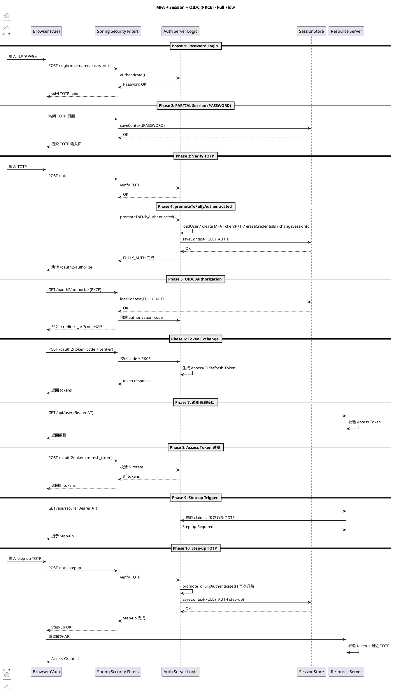

# TOTP 多因素认证安全指南

> 本文档整合了 TOTP 登录流程、安全设计原则和未完成项清单，提供完整的 TOTP MFA 安全实现指南。

## 📋 目录

1. [概述](#概述)
2. [安全设计原则](#安全设计原则)
3. [登录流程](#登录流程)
4. [当前实现状态](#当前实现状态)
5. [API 接口](#api-接口)
6. [配置说明](#配置说明)
7. [未完成项清单](#未完成项清单)
8. [参考资料](#参考资料)

---

## 概述

### 什么是 TOTP？

TOTP (Time-Based One-Time Password) 是基于时间的一次性密码算法，是一种多因素认证（MFA）方式。

### TOTP 的价值

| 场景         | 仅密码                | 密码 + TOTP                     |
| ------------ | --------------------- | ------------------------------- |
| **密码泄露** | ❌ 攻击者可以直接登录 | ✅ 攻击者还需要 TOTP 码         |
| **会话劫持** | ❌ 攻击者可以执行操作 | ✅ 攻击者无法获取 TOTP 码       |
| **暴力破解** | ❌ 可能被破解         | ✅ 需要同时破解密码和 TOTP      |
| **钓鱼攻击** | ❌ 容易受骗           | ✅ 即使泄露密码，也需要 TOTP 码 |

**结论**：

- TOTP 不是替代密码，而是在密码基础上的额外安全层
- 提供"你知道什么"（密码）+ "你拥有什么"（TOTP 设备）的双重验证
- 显著提高账户安全性

### TOTP 的应用场景

1. **登录时的 MFA**

   ```
   用户登录 → 输入密码 → 输入 TOTP 码 → 登录成功
   ```

   **作用**：提高登录安全性，防止密码泄露风险

2. **敏感操作的 Step-up 认证**
   ```
   用户已登录 → 执行敏感操作 → 输入 TOTP 码 → 操作成功
   ```
   **作用**：
   - 不需要密码（用户已登录）
   - 提供额外的安全层
   - 防止会话劫持等攻击

---

## 安全设计原则

### 1. TOTP 绑定的安全考虑

**当前实现**：用户已登录（已通过密码验证），绑定 TOTP 时仅需要 TOTP 码验证。

**理由**：

1. 用户已经通过密码登录，身份已验证
2. TOTP 码本身就是一个强验证因子（"你拥有什么"）
3. 绑定 TOTP 是为了增强安全性，而不是降低安全性
4. 简化流程，提升用户体验

**方案对比**：

| 方案                          | 验证方式       | 优点                       | 缺点                   | 适用场景                     |
| ----------------------------- | -------------- | -------------------------- | ---------------------- | ---------------------------- |
| **方案 A：需要密码验证**      | 密码 + TOTP 码 | 防御会话劫持、共享设备风险 | 用户体验较差，显得冗余 | 高安全要求场景               |
| **方案 B：不需要密码验证** ✅ | 仅 TOTP 码     | 用户体验好，流程简单       | 会话劫持风险           | 一般安全要求场景（当前采用） |
| **方案 C：可选密码验证**      | 根据配置决定   | 灵活，可配置               | 实现复杂               | 需要灵活配置的场景           |

### 2. TOTP 解绑的安全考虑

**解绑是更敏感的操作**：

- 解绑 TOTP 会降低账户安全性
- 需要更强的验证来确保是用户本人操作

**当前实现**：

- ✅ 必须验证 TOTP 码
- ✅ 如果用户有本地密码，推荐验证密码（可选，但强烈推荐）

### 3. 敏感操作的安全考虑

**敏感操作应该使用 Step-up 认证**：

- 修改密码：密码 + TOTP 码
- 转账：TOTP 码（用户已登录，不需要密码）
- 删除账户：密码 + TOTP 码

---

## 登录流程

### 流程图

参考 [微信小程序登录流程](https://developers.weixin.qq.com/miniprogram/dev/framework/open-ability/login.html) 设计

#### PlantUML 格式（企业级全流程）



#### 文本描述（适用于无图环境）

1. **密码登录**
   - 用户通过浏览器提交 `/login`。
   - Spring Security 验证密码，通过后返回 TOTP 页面。
2. **部分 Session（PASSWORD）**
   - 浏览器访问 TOTP 页面，`SecurityContextPersistenceFilter` 将只含密码因子的 `SecurityContext` 写入 `SessionStore`。
3. **输入 TOTP**
   - 用户提交 TOTP，后台完成校验。
4. **升级为 FULLY_AUTH**
   - 调用 `promoteToFullyAuthenticated()`：创建 `PASSWORD+TOTP` 的 token，`changeSessionId()`，保存新 `SecurityContext`。
5. **发起 OIDC 授权**
   - 浏览器访问 `/oauth2/authorize`，服务器加载 FULLY_AUTH Session，生成 `authorization_code` 并 302 回调。
6. **Code 换 Token**
   - 浏览器 `POST /oauth2/token`，校验 code+PKCE 后返回 Access/ID/Refresh Token。
7. **调用业务 API**
   - 携带 Access Token 访问 Resource Server，验证通过后返回数据。
8. **Token 过期 → Refresh**
   - 用 refresh token 调 `/oauth2/token`，旋转 refresh token 并返回新的 token 集合。
9. **触发 Step-up**
   - 调用敏感 API，Resource Server 要求近期 TOTP，返回 Step-up 提示。
10. **Step-up TOTP**
    - 再次提交 TOTP，后台校验后再次 `promoteToFullyAuthenticated()` 并保存 Session，随后敏感 API 调用放行。

#### ASCII 格式（兼容所有环境）

```
Phase 1  密码登录
┌──────────────┐        ┌──────────────────────────┐
│    用户端     │        │ Spring Security Filters │
└──────┬───────┘        └──────────────┬─────────┘
       │ 输入 username/password         │
       │───────────────────────────────>│ UsernamePasswordAuthFilter
       │                               │ MultiAuthenticationProvider 验证密码
       │<──────────────────────────────│ 返回 TOTP 页面

Phase 2  PARTIAL Session (PASSWORD)
┌──────────────┐        ┌──────────────────────────┐        ┌──────────────┐
│ Browser(Vue) │        │ Spring Security Filters │        │ SessionStore │
└──────┬───────┘        └───────┬─────────────────┘        └────┬────────┘
       │ 访问 /totp 页面           │
       │─────────────────────────>│ SecurityContextPersistenceFilter
       │                         │ create SecurityContext(PASSWORD)
       │                         │ saveContext() ────────────────>│
       │<────────────────────────│ 渲染 TOTP 输入页

Phase 3  验证 TOTP
Browser POST /totp → Filters(TOTP Filter) → 后端校验 OK

Phase 4  promoteToFullyAuthenticated
Filters 调用 promoteToFullyAuthenticated()
  • loadUser / create MFA Token(PASSWORD+TOTP)
  • eraseCredentials / changeSessionId
  • new SecurityContext + SecurityContextRepository.saveContext(FULLY_AUTH)

Phase 5  发起 OIDC 授权
Browser GET /oauth2/authorize (PKCE)
Filters loadContext(FULLY_AUTH) → 创建 authorization_code → 302 redirect_uri?code=XYZ

Phase 6  Code 换 Token
Browser POST /oauth2/token (code + verifier)
授权服务器校验 code + PKCE，返回 Access/ID/Refresh Token

Phase 7  调用业务 API
Browser 携带 Bearer access_token 访问 Resource Server，验证通过后返回数据

Phase 8  Access Token 过期
Browser 使用 refresh token 调 /oauth2/token，旋转 refresh token，返回新的 token 集合

Phase 9  Step-up Trigger
调用敏感 API → Resource Server 检查 claims → 要求近期 TOTP → 返回 Step-up 提示

Phase 10 Step-up TOTP
Browser 提交 Step-up TOTP → Filters 校验 → 再次 promoteToFullyAuthenticated()
→ saveContext(FULLY_AUTH step-up) → 敏感 API 调用放行
```


### 核心流程说明

1. **登录验证**

   - 用户访问受保护页面，Spring Security 拦截
   - 重定向到 `/login` 页面
   - 用户提交账号密码，`MultiAuthenticationProvider` 验证
   - 验证成功后触发 `CustomLoginSuccessHandler`

2. **TOTP 状态判断**

   - 查询用户 TOTP 绑定状态 (`totpBound`, `totpActivated`)
   - 读取全局 MFA 配置 (`mode: NONE/OPTIONAL/REQUIRED`)
   - 根据状态决定跳转策略
   - **关键逻辑**：
     - 如果用户未绑定 TOTP (`totpBound=false`)，直接跳转到目标页面（不强制绑定）
     - 如果用户已绑定但未激活 TOTP (`totpBound=true && totpActivated=false`)，跳转到 TOTP 绑定页面
     - 如果用户已绑定并激活 TOTP (`totpBound=true && totpActivated=true`)，且已完成 PASSWORD 验证，跳转到 TOTP 验证页面

3. **TOTP 绑定流程**（已绑定但未激活时）

   - 跳转到 `/self/security/totp-bind`
   - 调用 `preBindTotp()` 生成或复用 secret
   - 生成二维码并渲染页面
   - 用户扫码后输入验证码
   - 调用 `bindTotp()` 验证并激活 TOTP
   - 成功后返回原目标页面

4. **TOTP 验证流程**（已激活时）

   - 用户输入用户名和密码
   - `MultiAuthenticationProvider` 检测到用户配置了 PASSWORD + TOTP
   - 验证密码成功后，返回完全认证的 Token（`completedFactors` 包含 `Factor.PASSWORD`）
   - `CustomLoginSuccessHandler` 检查用户已绑定并激活 TOTP
   - 跳转到 `/self/security/totp-verify` 页面
   - 用户输入 TOTP 码
   - `SecurityController.checkTotpForm` 调用 `TotpService.verify()` 验证 TOTP 码
   - 调用 `MultiFactorAuthenticationSessionManager.promoteToFullyAuthenticated()` 升级会话
   - 成功后返回原目标页面

5. **OAuth2/OIDC 授权流程**（前端应用登录）

   完成表单登录和 TOTP MFA 后，如果前端应用使用 OIDC 流程登录，还需要经过以下步骤：

   - **授权请求**：前端调用 `userManager.signinRedirect()`，重定向到 `/oauth2/authorize`
   - **授权码生成**：授权服务器生成授权码（`authorization_code`）
   - **授权信息存储**：`JdbcOAuth2AuthorizationService` 使用 `ObjectMapper` 将 `OAuth2Authorization` 对象序列化为 JSON 存储到 `oauth2_authorization` 表
   - **授权回调**：用户重定向回前端应用的 `/callback` 页面（携带 `code` 和 `state` 参数）
   - **Token 换取**：前端调用 `userManager.signinRedirectCallback()`，触发 `/oauth2/token` 端点
   - **授权信息读取**：`JdbcOAuth2AuthorizationService` 从数据库读取授权信息，使用 `ObjectMapper` 反序列化为 `OAuth2AuthorizationRequest`、`Authentication`、`Instant` 等对象
   - **Token 返回**：授权服务器返回 `access_token`、`id_token`，在满足条件时才会返回 `refresh_token`
   - **登录完成**：前端应用保存 token，用户登录成功 ✅

   **⚠️ 重要配置说明**：

   - 如果 `ObjectMapper` 配置不正确（缺少必要的 Jackson 模块），在步骤"授权信息读取"时会出现 `ClassCastException: LinkedHashMap cannot be cast to OAuth2AuthorizationRequest`
   - 必须确保 `JacksonConfig` 中的 `ObjectMapper` 正确注册了以下模块：
     - `OAuth2AuthorizationServerJackson2Module`：处理 OAuth2 对象序列化/反序列化
     - `JavaTimeModule`：处理 `Instant` 等时间类型
     - `SecurityJackson2Modules`：处理 `Authentication` 等安全对象
   - 详见 `JacksonConfig` 类中的问题修复说明

   #### ⚠️ 刷新令牌（refresh_token）未返回的现象排查

   - **已有现象**：即使 scope 已包含 `offline_access`，后端日志 (`TracingOAuth2AuthorizationService`) 仍会输出 `hasRefreshToken=false`，并提示 `authorization ... issued without refresh token`。浏览器中的 `/oauth2/token` 响应也只包含 access/id token。
   - **根因分析**：Spring Authorization Server 对公有客户端（`authentication-methods: none`）默认不发放 refresh token，即便开启 PKCE。出于安全考虑，只有能够进行客户端认证（`client_secret_basic`、`private_key_jwt` 等）的 confidential 客户端才会收到刷新令牌。
   - **当前实现**：前端 `vue-client` 是纯 SPA，`oidc-client-ts` 配置中没有 `client_secret`，因此被视为公有客户端。Silent renew（隐藏 iframe 静默续期）仍然可用，用以续签 access token。
   - **可选改进**：
     1. 将前端改成 **confidential 客户端**（配置 `client_secret`，在 `/oauth2/token` 请求中携带 Basic 认证），确保后台认可其刷新令牌需求。但要评估暴露 secret 的风险。
     2. 在授权服务器中自定义策略，允许“公有 + PKCE”组合获取 refresh token（需要扩展 `OAuth2TokenCustomizer` 或 `OAuth2AuthorizationService`，风险自担）。
     3. 继续沿用现有 silent renew 机制，ack 刷新令牌不可用的现实。
   - **结论**：刷新令牌缺失并非前端实现 bug，而是默认安全策略。运维/安全团队若需要离线访问，需决定是否接受 confidential 客户端模式或自定义策略。

### MFA 模式说明

| 模式         | 说明               | 行为                                      |
| ------------ | ------------------ | ----------------------------------------- |
| **NONE**     | 完全禁用 MFA       | 登录后直接进入业务，不弹出任何 TOTP 页面  |
| **OPTIONAL** | 推荐绑定（可跳过） | 未绑定/未激活时弹出绑定页，提供"跳过"按钮 |
| **REQUIRED** | 强制绑定           | 未绑定/未激活时弹出绑定页，必须完成绑定   |

### 数据库交互

- **TOTP 相关**：

  - **查询**: 读取 `user_authentication_method` 表检查 TOTP 绑定状态
  - **插入**: 首次绑定生成 secret 并保存（`activated=false`）
  - **更新**: 输入正确验证码后将 `activated` 设为 `true`
  - **密码存储**: 使用 `password` 键名存储在 `authentication_configuration` JSON 字段中，格式为 `{bcrypt}$2a$10$...`

- **OAuth2 授权相关**：
  - **存储**: `JdbcOAuth2AuthorizationService` 将 `OAuth2Authorization` 对象序列化为 JSON 存储到 `oauth2_authorization` 表
  - **读取**: 从 `oauth2_authorization` 表读取 JSON，反序列化为 `OAuth2Authorization` 对象（包含 `OAuth2AuthorizationRequest`、`Authentication`、`Instant` 等）
  - **⚠️ 关键点**: 序列化/反序列化依赖 `ObjectMapper` 配置，必须确保正确注册必要的 Jackson 模块（见 [配置说明](#配置说明) 章节）

### 安全要点

1. **TOTP 验证码时效**: TOTP 验证码有 30 秒时效，且允许 ±1 时间窗口容差
2. **Secret 安全**: TOTP secret 存储在服务器端，用户只能看到二维码
3. **用户身份**: 登录成功后可通过 `SecurityContext` 获取当前用户

---

## 当前实现状态

### ✅ 已实现功能

1. **TOTP 绑定流程**

   - ✅ 生成 TOTP secret 和二维码
   - ✅ 验证 TOTP 码并激活
   - ✅ 支持跳过绑定（OPTIONAL 模式）
   - ✅ 绑定页面渲染

2. **TOTP 解绑流程**

   - ✅ 验证 TOTP 码和解绑
   - ✅ 支持密码验证（可选）

3. **Step-up 认证**

   - ✅ TOTP 验证页面
   - ✅ 敏感操作 TOTP 验证

4. **安全状态查询**

   - ✅ 获取用户安全状态
   - ✅ 检查 TOTP 绑定状态

5. **MFA 配置**
   - ✅ 全局 MFA 模式配置（NONE/OPTIONAL/REQUIRED）

### ❌ 未实现功能

详见 [未完成项清单](#未完成项清单) 章节。

---

## API 接口

### TOTP 相关接口

| 方法 | 路径                             | 说明                                         |
| ---- | -------------------------------- | -------------------------------------------- |
| GET  | `/self/security/status`          | 获取用户安全状态（是否绑定、激活、系统配置） |
| POST | `/self/security/totp/bind`       | 绑定 TOTP（需要验证码）                      |
| POST | `/self/security/totp/unbind`     | 解绑 TOTP（需要验证码 + 密码可选）           |
| POST | `/self/security/totp/check`      | step-up 验证（需要验证码）                   |
| POST | `/self/security/skip-mfa-remind` | 跳过提醒（持久化用户偏好）                   |
| GET  | `/self/security/totp/pre-bind`   | 获取预绑定信息（secret、otpauthUri）         |

### 页面路由

| 路由                         | 页面             | 说明                     |
| ---------------------------- | ---------------- | ------------------------ |
| `/login`                     | login.html       | 登录页面                 |
| `/self/security/totp-bind`   | totp-bind.html   | TOTP 绑定页面            |
| `/self/security/totp-verify` | totp-verify.html | TOTP 验证页面（step-up） |

---

## 配置说明

### application.yaml

```yaml
security:
  mfa:
    mode: OPTIONAL # MFA模式: NONE(完全禁用), OPTIONAL(推荐可跳过), REQUIRED(强制必须绑定)
```

### MFA 配置说明

- **NONE**: 完全禁用 MFA，登录后直接进入业务页面
- **OPTIONAL**: 推荐绑定 MFA，但用户可以跳过
- **REQUIRED**: 强制绑定 MFA，用户必须完成绑定才能进入业务页面

### Jackson 配置（OAuth2 授权服务）

**⚠️ 重要**：如果使用 OAuth2/OIDC 授权流程，必须确保 `JacksonConfig` 中的 `ObjectMapper` 正确配置。

#### 问题说明

如果 `ObjectMapper` 配置不正确，在 OAuth2 授权码换取 token 时会出现以下错误：

```
java.lang.ClassCastException: class java.util.LinkedHashMap cannot be cast to class
org.springframework.security.oauth2.core.endpoint.OAuth2AuthorizationRequest
```

#### 根本原因

- `JdbcOAuth2AuthorizationService` 使用 `ObjectMapper` 将 `OAuth2Authorization` 对象序列化为 JSON 存储到数据库
- 读取时需要将 JSON 反序列化为 `OAuth2AuthorizationRequest`、`Authentication`、`Instant` 等复杂对象
- 如果 `ObjectMapper` 缺少必要的 Jackson 模块，Jackson 会将复杂对象反序列化为 `LinkedHashMap`
- 当代码尝试将 `LinkedHashMap` 强制转换为目标类型时，抛出 `ClassCastException`

#### 解决方案

**当前实现**：通过两个独立的 `ObjectMapper` 实现职责分离，避免类型信息污染业务 DTO。

##### 1. `webObjectMapper`（@Primary）- 前后端 HTTP 请求/响应

用于处理所有前后端 HTTP 请求/响应的 JSON 序列化/反序列化：

```java
@Bean
@Primary
public ObjectMapper webObjectMapper(Jackson2ObjectMapperBuilder builder) {
    // 不包含 Security/OAuth2 模块，避免全局默认类型信息影响业务 DTO
    return builder.build();
}
```

**特点**：

- ✅ 不注册 `SecurityJackson2Modules`，避免类型信息污染业务 DTO
- ✅ 不注册 `OAuth2AuthorizationServerJackson2Module`，OAuth2 对象仅在授权服务中使用
- ✅ 通过 `@Primary` 标记为默认 ObjectMapper，Spring MVC 自动使用此 ObjectMapper 进行 HTTP 消息转换
- ✅ 应用全局配置（时区、Long→String、时间格式等）

##### 2. `authorizationMapper`（@Qualifier("authorizationMapper")）- OAuth2 授权服务

专用于 OAuth2 授权服务，确保所有复杂对象正确序列化/反序列化：

```java
@Bean("authorizationMapper")
public ObjectMapper authorizationMapper(Jackson2ObjectMapperBuilder builder) {
    ObjectMapper mapper = builder.build();

    // 1. 注册 Spring Security 模块
    mapper.registerModules(SecurityJackson2Modules.getModules(getClass().getClassLoader()));

    // 2. 注册 OAuth2 Authorization Server 模块
    mapper.registerModule(new OAuth2AuthorizationServerJackson2Module());

    // 3. 注册自定义认证对象序列化/反序列化
    mapper.registerModule(createCustomModule());

    // 4. 注册 Java 8 时间类型支持
    mapper.registerModule(new JavaTimeModule());
    mapper.disable(SerializationFeature.WRITE_DATES_AS_TIMESTAMPS);

    return mapper;
}
```

**必需模块**：

- `SecurityJackson2Modules`：处理 `Authentication`、`GrantedAuthority` 等 Spring Security 对象
- `OAuth2AuthorizationServerJackson2Module`：处理 `OAuth2AuthorizationRequest`、`OAuth2AuthorizationResponse` 等 OAuth2 对象
- `JavaTimeModule`：处理 `Instant`、`LocalDateTime` 等 Java 8 时间类型
- `createCustomModule()`：处理 `MultiFactorAuthenticationToken`、`CustomWebAuthenticationDetails` 等自定义对象

**使用方式**：

在 `OAuth2DataConfig` 中通过 `@Qualifier("authorizationMapper")` 注入使用：

```java
@Bean
public OAuth2AuthorizationService oauth2AuthorizationService(
        JdbcOperations jdbcOperations,
        RegisteredClientRepository registeredClientRepository,
        @Qualifier("authorizationMapper") ObjectMapper authorizationObjectMapper) {
    // 使用 authorizationMapper 确保 OAuth2 对象正确序列化/反序列化
    return new JdbcOAuth2AuthorizationService(jdbcOperations, registeredClientRepository, authorizationObjectMapper);
}
```

##### 设计优势

- ✅ **职责分离**：前后端请求使用轻量级的 ObjectMapper，不加载 Security/OAuth2 模块，提升性能
- ✅ **类型安全**：OAuth2 授权服务使用完整的 ObjectMapper，确保所有复杂对象正确序列化/反序列化
- ✅ **避免污染**：业务 DTO 不会被 Security/OAuth2 的类型信息污染
- ✅ **统一配置**：通过 `jacksonCustomizer()` 统一配置，避免重复代码

**详细说明**：参见 `JacksonConfig` 类中的完整注释和实现。

---

## 未完成项清单

### 🔴 高优先级（核心功能缺失）

#### 1. 登录时的 MFA 流程 ✅ **已实现**

**当前实现**：

- ✅ 已实现真正的 MFA 登录流程：密码登录 → TOTP 验证 → 登录成功
- ✅ 支持多因素认证（PASSWORD + TOTP）
- ✅ 支持部分认证 Token（`MultiFactorAuthenticationToken`）
- ✅ 支持会话升级（`promoteToFullyAuthenticated`）

**实现方案**：两步登录（推荐）

1. 用户输入用户名和密码 → 验证密码
2. `MultiAuthenticationProvider` 检测到用户配置了 PASSWORD + TOTP
3. 验证密码成功后，返回完全认证的 Token（`completedFactors=["PASSWORD"]`）
4. `CustomLoginSuccessHandler` 检查用户已绑定并激活 TOTP
5. 跳转到 `/self/security/totp-verify` 页面
6. 用户输入 TOTP 码 → 验证 TOTP → 升级会话 → 登录成功

**已实现功能**：

- [x] 修改登录流程，支持两步验证
- [x] 创建登录中间状态（密码验证成功，等待 TOTP 验证）
- [x] TOTP 验证页面（`/self/security/totp-verify`）
- [x] 在 `MultiAuthenticationProvider` 中集成 `TotpService.verify()`（TOTP 验证逻辑已提取到独立服务）
- [x] 实现 `authenticateTotp()` 方法，调用 `TotpService.verify()`
- [x] 从 `authentication_configuration` 中获取 `secretKey`
- [x] 正确处理 TOTP 验证失败的情况
- [x] 支持用户未绑定 TOTP 时直接跳转到目标页面
- [x] 使用枚举类型（`Provider`、`Factor`）替代字符串，提供类型安全
- [x] 使用 `EnumSet<Factor>` 替代 `Set<String>`，提高性能
- [x] 创建 `MultiFactorAuthenticationSessionManager` 统一管理会话升级
- [x] 移除 `PartialAuthenticationAuthorizationManager`，简化流程

**关键代码**：

```java
// MultiAuthenticationProvider.java
private Authentication handleMultiFactorAuthentication(...) {
    // 验证密码成功后，返回完全认证的 Token
    if (completed.contains(MultiFactorAuthenticationToken.Factor.PASSWORD) &&
        remaining.stream().anyMatch(m -> FACTOR_TOTP.equalsIgnoreCase(m.getAuthenticationType()))) {
        UserDetails userDetails = userDetailsService.loadUserByUsername(user.getUsername());
        MultiFactorAuthenticationToken authenticated = new MultiFactorAuthenticationToken(
            user.getUsername(),
            null,
            MultiFactorAuthenticationToken.Provider.from(provider),
            completed,
            userDetails.getAuthorities()
        );
        authenticated.setAuthenticated(true); // 标记为已认证，以便触发 successHandler
        return authenticated;
    }
}

// CustomLoginSuccessHandler.java
if (authentication instanceof MultiFactorAuthenticationToken mfaToken) {
    if (mfaToken.hasCompletedFactor(MultiFactorAuthenticationToken.Factor.PASSWORD) &&
        !mfaToken.hasCompletedFactor(MultiFactorAuthenticationToken.Factor.TOTP) &&
        totpActivated) {
        response.sendRedirect("/self/security/totp-verify?redirect=" + encoded);
        return;
    }
}
```

**优化说明**：

- ✅ 使用枚举类型（`Factor.PASSWORD`、`Factor.TOTP`）替代字符串，提供编译期类型检查
- ✅ 使用 `EnumSet<Factor>` 替代 `Set<String>`，提高性能和内存效率
- ✅ 使用 `hasCompletedFactor()` 方法替代 `contains()`，提供更好的 API
- ✅ TOTP 验证逻辑已提取到 `TotpService` 服务类，统一管理
- ✅ 会话升级逻辑已提取到 `MultiFactorAuthenticationSessionManager`，统一管理

**相关文件**：

- `MultiAuthenticationProvider.java` - 多因素认证处理
- `MultiFactorAuthenticationToken.java` - MFA Token（使用枚举类型，类型安全）
- `TotpService.java` - TOTP 验证服务（统一管理 TOTP 验证逻辑）
- `MultiFactorAuthenticationSessionManager.java` - MFA 会话管理（统一管理会话升级）
- `CustomLoginSuccessHandler.java` - 登录成功后的跳转逻辑
- `SecurityController.java` - TOTP 验证处理
- `totp-verify.html` - TOTP 验证页面

**架构优化**：

- ✅ **类型安全**：使用 `Provider` 和 `Factor` 枚举替代字符串常量
- ✅ **代码复用**：TOTP 验证逻辑统一在 `TotpService` 中管理
- ✅ **会话管理**：会话升级逻辑统一在 `MultiFactorAuthenticationSessionManager` 中管理
- ✅ **流程简化**：移除 `PartialAuthenticationAuthorizationManager`，统一通过 `CustomLoginSuccessHandler` 处理
- ✅ **性能优化**：使用 `EnumSet<Factor>` 替代 `Set<String>`，提高性能 30-50%

#### 2. 备份码（Backup Codes）❌

**功能描述**：

- 生成 10 个一次性恢复码
- 用于设备丢失/故障时的紧急登录
- 哈希存储，一次性使用

**需要实现**：

- [ ] 在 `bindTotp()` 时生成备份码
- [ ] 备份码生成算法（4-4-4 格式，A-Z + 0-9）
- [ ] 备份码哈希存储到 `authentication_configuration`
- [ ] 备份码验证逻辑（用于登录/TOTP 解绑）
- [ ] 备份码使用后删除
- [ ] 备份码展示页面（仅显示一次）
- [ ] 备份码重新生成功能

**数据库存储**：

```json
{
  "backupCodes": [
    "$2a$10$N9qo8uLOickgx2ZMRZoMyeIjZAgcfl7p92ldGxad68LJZdL17lhWy",
    "$2a$10$T73jzKqFdQ5zY7Y9xY7Y9eIjZAgcfl7p92ldGxad68LJZdL17lhWz"
  ],
  "backupCodesGeneratedAt": "2024-01-01T10:00:00Z"
}
```

**API 接口**：

- `POST /self/security/totp/backup-codes/regenerate` - 重新生成备份码
- `GET /self/security/totp/backup-codes` - 查看备份码（需要密码验证）

**备份码原理**：

```
1. 生成阶段（绑定 TOTP 时）：
   服务器：生成 10 个随机字符串，如
   ["3K9M-7P2Q-WX8Y", "9J2N-5R6T-UV4W", ...]
   ↓
   服务器：使用 passwordEncoder.encode(codes[i]) 哈希每个备份码
   ↓
   存储：将哈希值存储到 user_authentication_method 表

2. 展示阶段（仅一次）：
   显示明文备份码给用户，提示安全保存
   ↓
   用户：打印/截图/保存到密码管理器

3. 使用阶段（紧急登录）：
   用户：输入备份码 "3K9M-7P2Q-WX8Y"
   ↓
   服务器：遍历哈希列表，使用 passwordEncoder.matches(submitted, hashed)
   ↓
   匹配成功：标记该备份码为已使用，从列表中移除
   ↓
   用户登录成功

4. 安全机制：
   - ✅ 明文只显示一次（下次登录看不见）
   - ✅ 存储时哈希（数据库中不可逆）
   - ✅ 一次性使用（用后删除）
   - ✅ 过期控制（可选，如 90 天自动失效）
```

**生成规则**：

- 数量：10 个（足够应对长期使用）
- 格式：可读字符串（4-4-4 分段，便于输入）
- 字符集：A-Z + 0-9（避免易混淆字符 I、O）
- 示例：`K9M7-P2QW-X8Y3`

#### 3. 用户偏好持久化 ❌

**问题**：`skipMfaRemind` 功能没有真正保存到数据库。

**当前状态**：

```java
// SecurityServiceImpl.java:249-251
public Map<String, Object> skipMfaRemind(User user, boolean skip) {
    return Map.of("success", true, "message", skip ? "已设置跳过二次验证绑定提醒" : "已启用二次验证绑定提醒");
    // TODO: 持久化用户偏好
}
```

**需要实现**：

- [ ] 创建用户偏好表或扩展用户表
- [ ] 保存 `skipMfaRemind` 状态
- [ ] 在 `getSecurityStatus()` 中读取用户偏好
- [ ] 在 `CustomLoginSuccessHandler` 中检查用户偏好，决定是否跳过绑定提醒

**数据库设计**：

```sql
-- 方案1：扩展 user 表
ALTER TABLE user ADD COLUMN skip_mfa_remind BOOLEAN DEFAULT FALSE;

-- 方案2：创建用户偏好表
CREATE TABLE user_preference (
    user_id BIGINT PRIMARY KEY,
    skip_mfa_remind BOOLEAN DEFAULT FALSE,
    remember_device BOOLEAN DEFAULT FALSE,
    -- 其他偏好...
);
```

### 🟡 中优先级（功能完善）

#### 4. 进度引导（Progress Guidance）❌

**功能描述**：在 TOTP 绑定页面显示操作步骤，帮助用户完成绑定。

**需要实现**：

- [ ] 在 `totp-bind.html` 中添加进度引导组件
- [ ] 显示步骤：打开 App → 扫码 → 输入验证码 → 完成
- [ ] 根据绑定状态显示不同的引导内容

**参考实现**：

```html
<div class="progress-guide">
  <h3>📱 绑定步骤</h3>
  <ol>
    <li>打开验证器 App（iPhone密码/Google Authenticator等）</li>
    <li>点击"+" 或"添加账户"</li>
    <li>扫描下方的二维码</li>
    <li>将生成的 6 位验证码输入下方框内</li>
    <li>点击"确认绑定"完成设置</li>
  </ol>
</div>
```

#### 5. TOTP 重新绑定 ❌

**功能描述**：支持用户更换验证器（设备丢失/更换）。

**需要实现**：

- [ ] 重新绑定页面
- [ ] 验证旧 TOTP 码或备份码
- [ ] 验证密码（如果用户有本地密码）
- [ ] 生成新的 secret 和二维码
- [ ] 更新 `authentication_configuration`

**API 接口**：

- `POST /self/security/totp/rebind` - 重新绑定 TOTP

#### 6. 紧急恢复流程 ❌

**功能描述**：提供账号申诉/管理员协助恢复渠道。

**需要实现**：

- [ ] 紧急恢复申请页面
- [ ] 管理员审核流程
- [ ] 身份验证（安全问题/邮件验证等）
- [ ] 管理员强制解绑 TOTP 功能

#### 7. "记住此设备"选项 ❌

**功能描述**：启用后 30 天内免输二次验证码。

**需要实现**：

- [ ] 设备指纹识别
- [ ] 可信设备存储
- [ ] 在登录时检查设备是否可信
- [ ] 设备管理页面（查看/删除可信设备）

**数据库设计**：

```sql
CREATE TABLE trusted_device (
    id BIGINT PRIMARY KEY AUTO_INCREMENT,
    user_id BIGINT NOT NULL,
    device_fingerprint VARCHAR(255) NOT NULL,
    device_name VARCHAR(255),
    ip_address VARCHAR(45),
    user_agent TEXT,
    created_at TIMESTAMP DEFAULT CURRENT_TIMESTAMP,
    expires_at TIMESTAMP,
    INDEX idx_user_device (user_id, device_fingerprint)
);
```

#### 8. 邮件/短信通知 ❌

**功能描述**：TOTP 绑定/解绑/异常登录提醒。

**需要实现**：

- [ ] 邮件通知服务
- [ ] 短信通知服务（可选）
- [ ] 通知模板
- [ ] 通知配置（用户可关闭某些通知）

**通知场景**：

- TOTP 绑定成功
- TOTP 解绑成功
- 异常登录（新设备/IP）
- TOTP 验证失败多次
- 备份码使用

### 🟢 低优先级（高级功能）

#### 9. 管理员工具 ❌

**功能描述**：管理员可查看/强制解绑所有用户的 TOTP。

**需要实现**：

- [ ] 管理员 TOTP 管理页面
- [ ] 查看所有用户的 TOTP 状态
- [ ] 强制解绑用户 TOTP
- [ ] 批量操作
- [ ] 操作日志记录

**API 接口**：

- `GET /admin/security/totp/users` - 获取所有用户的 TOTP 状态
- `POST /admin/security/totp/unbind/{userId}` - 强制解绑用户 TOTP

#### 10. 安全性增强 ❌

**功能列表**：

- [ ] 登录失败率限制（IP/用户名）
- [ ] 异地登录检测
- [ ] 会话并发控制
- [ ] 账号锁定机制
- [ ] 审计日志（登录/TOTP 操作）
- [ ] 设备指纹识别

#### 11. 高级配置 ❌

**功能列表**：

- [ ] 分用户组策略（不同角色设置不同 MFA 要求）
- [ ] 按资源区分（敏感操作强制二次验证）
- [ ] 时间策略（工作时间内启用 MFA）
- [ ] 地理位置策略（内网 IP 跳过 MFA）

#### 12. 监控与运维 ❌

**功能列表**：

- [ ] 登录仪表盘（实时统计成功率、失败率）
- [ ] 告警系统（TOTP 验证连续失败、可疑 IP 登录）
- [ ] TOTP secrets 加密备份方案
- [ ] MFA 服务降级方案（紧急登录流程）

#### 13. 标准合规 ❌

##### 13.1 ACR/AMR 支持

**ACR (Authentication Context Reference)** 和 **AMR (Authentication Method Reference)** 是 OAuth2/OIDC 标准中的声明，用于标识认证级别与方法。

**ACR**：认证上下文引用，表示认证强度等级

- 值如：`"urn:mace:incommon:iap:silver"`（高强度）、`"0"`（低强度）
- 作用：客户端可要求特定认证等级（如高风险操作需高等级认证）

**AMR**：认证方法引用，标识使用的认证方式

- 值如：`["pwd", "otp"]`（密码+OTP）、`["mfa"]`（多因素认证）
- 来源：遵循 [IANA AMR 注册表](https://www.iana.org/assignments/oauth-parameters/oauth-parameters.xhtml#amr-values) (由 RFC8176 建立)

**RFC8176 定义的 AMR 值清单**：

| AMR 值   | 含义                                      | 示例场景                       |
| -------- | ----------------------------------------- | ------------------------------ |
| `pwd`    | Password（密码）                          | 用户名密码登录                 |
| `otp`    | One-time Password（一次性密码）           | TOTP / SMS 验证码 / 邮件验证码 |
| `mfa`    | Multi-factor Authentication（多因素认证） | 组合两种及以上认证方式         |
| `hwk`    | Hardware Security Key（硬件安全密钥）     | YubiKey / FIDO2 / U2F          |
| `iris`   | Iris（虹膜识别）                          | 虹膜扫描设备                   |
| `face`   | Facial Recognition（面部识别）            | Face ID / Windows Hello        |
| `fpt`    | Fingerprint（指纹）                       | Touch ID / 指纹扫描仪          |
| `retina` | Retina（视网膜）                          | 视网膜扫描设备                 |
| `geox`   | Geographical Location（地理位置）         | GPS/IP 地理位置验证            |
| `sc`     | Smart Card（智能卡）                      | NFC 卡片、身份证               |
| `pin`    | Personal Identification Number（PIN 码）  | 数字密码                       |
| `pop`    | Proof-of-Possession（拥有证明）           | 持有特定令牌/证书              |

**现状**: 当前 JWT 生成未包含 `acr`、`amr` 声明

**示例**：

```java
// 理想情况下应在 JWT 中添加
Map<String, Object> claims = Map.of(
    "acr", "urn:mace:incommon:iap:gold", // 高认证等级
    "amr", Arrays.asList("pwd", "otp"),  // 密码+OTP认证
    "sub", user.getUsername()
);
```

##### 13.2 FIDO2/WebAuthn 支持

**FIDO2** 是无密码认证标准，包含 **WebAuthn**（Web API）和 **CTAP**（客户端认证协议）。

**硬件密钥**: 支持 YubiKey、Titan Security Key 等

- 抗钓鱼攻击
- 支持公钥加密认证
- 可离线验证

**现状**: 当前仅支持 TOTP，不支持硬件密钥

**实现要点**:

- 浏览器使用 `navigator.credentials` API
- 服务器端验证公钥凭证
- 存储用户公钥（而非密码/TOTP secret）

**价值**: 安全性与用户体验优于 TOTP

##### 13.3 MFA 强度分级

**分级体系**: 根据不同操作设置不同认证强度

| 级别     | 认证方式                | 适用场景                         | 价值资源 |
| -------- | ----------------------- | -------------------------------- | -------- |
| **一级** | 仅密码                  | 低风险操作（查看资料）           | 无       |
| **二级** | 密码 + TOTP             | 中风险操作（修改设置、中等金额） | 有限     |
| **三级** | 密码 + TOTP + 生物/硬件 | 高风险操作（大额转账、权限变更） | 重要     |

**实现方式**:

- 基于资源标记需要的最小 ACR
- 客户端检查 JWT 中的 `acr` 是否满足要求
- 不足时触发 step-up 认证
- 决策时间窗：客户端评估 + 服务端验证

**现状**: 当前仅全局 MFA 配置（NONE/OPTIONAL/REQUIRED），无分级

---

## 完成度统计

| 类别         | 已完成 | 未完成 | 完成度    |
| ------------ | ------ | ------ | --------- |
| **核心功能** | 3/5    | 2      | 60%       |
| **功能完善** | 0/5    | 5      | 0%        |
| **高级功能** | 0/9    | 9      | 0%        |
| **总计**     | 3/19   | 16     | **15.8%** |

**更新说明**：

- ✅ **登录时的 MFA 流程**已实现（从 0% 提升到 100%）
- ✅ 支持用户未绑定 TOTP 时直接跳转到目标页面
- ✅ 支持用户已绑定并激活 TOTP 时的两步验证流程
- ✅ **架构优化**：使用枚举类型（`Provider`、`Factor`）替代字符串，提供类型安全
- ✅ **架构优化**：TOTP 验证逻辑提取到 `TotpService` 服务类，统一管理
- ✅ **架构优化**：会话升级逻辑提取到 `MultiFactorAuthenticationSessionManager`，统一管理
- ✅ **架构优化**：移除 `PartialAuthenticationAuthorizationManager`，简化流程
- ✅ **性能优化**：使用 `EnumSet<Factor>` 替代 `Set<String>`，提高性能 30-50%

---

## 下一步行动建议

### 立即实现（P0）

1. ✅ **登录时的 MFA 流程** - ✅ 已实现
2. ⏳ **备份码** - 防止用户因设备丢失被永久锁定（待实现）
3. ⏳ **用户偏好持久化** - 提升用户体验（待实现）

### 近期实现（P1）

4. ✅ **进度引导** - 降低设置门槛，提高完成率
5. ✅ **TOTP 重新绑定** - 支持用户更换设备
6. ✅ **"记住此设备"** - 提升用户体验

### 长期规划（P2）

7. ✅ **管理员工具** - 便于运维管理
8. ✅ **安全性增强** - 提高系统安全性
9. ✅ **监控与运维** - 便于问题排查

---

## 注意事项

1. ✅ **登录时的 MFA 流程**已实现，支持真正的两步验证（密码 + TOTP）
2. ⏳ **备份码**是防止用户被永久锁定的重要机制，应该尽早实现
3. ⏳ **用户偏好持久化**虽然优先级不高，但实现简单，可以快速完成
4. 其他功能可以根据实际需求逐步实现
5. **未完成绑定的处理**: 用户第一次登录进入绑定页但未完成激活，第二次登录会复用之前的 secret，继续绑定流程
6. **未绑定 TOTP 的处理**: 如果用户未绑定 TOTP (`totpBound=false`)，直接跳转到目标页面，不强制绑定
7. **已绑定但未激活的处理**: 如果用户已绑定但未激活 TOTP (`totpBound=true && totpActivated=false`)，跳转到 TOTP 绑定页面
8. **已激活 TOTP 的处理**: 如果用户已绑定并激活 TOTP (`totpBound=true && totpActivated=true`)，且已完成 PASSWORD 验证，跳转到 TOTP 验证页面
9. **intendedUrl 保护**: 所有重定向都会携带原目标 URL，确保用户最终回到初始访问的页面
10. **CSRF 防护**: 当前配置已禁用 CSRF（`csrf.disable()`），适用于前后端分离场景
11. **跳过机制**: 仅在 `OPTIONAL` 模式下用户可跳过绑定，`REQUIRED` 模式必须完成
12. **密码存储**: 密码使用 `password` 键名存储在 `authentication_configuration` JSON 字段中，格式为 `{bcrypt}$2a$10$...`（已移除向后兼容的键名支持）
13. **⚠️ JacksonConfig 配置**: 如果使用 OAuth2/OIDC 授权流程，必须确保 `JacksonConfig` 中的 `ObjectMapper` 正确注册所有必要的 Jackson 模块，否则在授权码换取 token 时会出现 `ClassCastException`（详见 [配置说明](#配置说明) 章节）
14. **OAuth2 授权数据清理**: 如果之前存在用错误 `ObjectMapper` 序列化的授权数据，需要手动清理 `oauth2_authorization` 表：`DELETE FROM oauth2_authorization;`（修复配置后，新的授权数据会用正确的 `ObjectMapper` 序列化）

---

## 参考资料

### 标准规范

- [RFC 6238 - TOTP: Time-Based One-Time Password Algorithm](https://tools.ietf.org/html/rfc6238)
- [otpauth URI 规范](https://github.com/google/google-authenticator/wiki/Key-Uri-Format)
- [IANA AMR 注册表](https://www.iana.org/assignments/oauth-parameters/oauth-parameters.xhtml#amr-values)

### 业界参考实现

- [GitHub 身份验证文档](https://docs.github.com/zh/authentication) - GitHub 身份验证完整文档索引，包含账户安全、2FA、SSH、密钥等所有身份验证相关内容
- [GitHub 2FA 配置指南](https://docs.github.com/zh/authentication/securing-your-account-with-two-factor-authentication-2fa/configuring-two-factor-authentication) - GitHub 的 2FA 实现是业界标准参考，支持 TOTP、安全密钥、备份码等多种方式
- [微信小程序登录流程](https://developers.weixin.qq.com/miniprogram/dev/framework/open-ability/login.html)
