# TOTP 多因素认证接入指南

> 本文档提供完整的 TOTP MFA 接入指南，包括快速开始、配置说明、集成步骤、流程详解、问题排查和最佳实践。

## 📋 目录

1. [快速开始](#快速开始) ⭐ 5分钟快速接入
2. [前置条件](#前置条件) ⭐ 依赖和数据库要求
3. [配置说明](#配置说明) 🔄 集中所有配置
4. [集成步骤](#集成步骤) ⭐ 一步步集成指南
5. [登录流程](#登录流程) ✅ 深入理解流程
6. [API 接口](#api-接口) ✅ 完整接口文档
7. [测试验证](#测试验证) ⭐ 验证方法和测试用例
8. [常见问题](#常见问题) ⭐ 系统化问题排查
9. [最佳实践](#最佳实践) ⭐ 使用建议
10. [当前实现状态](#当前实现状态) ✅ 功能清单
11. [未完成项清单](#未完成项清单) ✅ 待实现功能
12. [参考资料](#参考资料) ✅ 标准规范和参考

---

## 快速开始

### 什么是 TOTP MFA？

TOTP (Time-Based One-Time Password) 是基于时间的一次性密码，提供"密码 + TOTP 码"的双重验证，显著提高账户安全性。

### 3 步快速接入

#### 步骤 1：配置 MFA 模式

在 `application.yaml` 中添加：

```yaml
security:
  mfa:
    mode: OPTIONAL  # NONE(禁用) | OPTIONAL(推荐) | REQUIRED(强制)
```

#### 步骤 2：确保数据库表存在

确保 `user_authentication_method` 表已创建（如果使用 OAuth2，还需 `oauth2_authorization` 表）。

**必需表：`user_authentication_method`**

```sql
CREATE TABLE IF NOT EXISTS `user_authentication_method` (
    `id` BIGINT AUTO_INCREMENT PRIMARY KEY COMMENT '主键ID',
    `user_id` BIGINT NOT NULL COMMENT '用户ID',
    `authentication_provider` VARCHAR(50) NOT NULL COMMENT '认证提供者',
    `authentication_type` VARCHAR(50) NOT NULL COMMENT '认证类型',
    `authentication_configuration` JSON NOT NULL COMMENT '认证配置',
    `is_primary_method` BOOLEAN DEFAULT FALSE COMMENT '是否主要认证方法',
    `is_method_enabled` BOOLEAN DEFAULT TRUE COMMENT '是否启用',
    `authentication_priority` INT DEFAULT 0 COMMENT '认证优先级',
    `last_verified_at` TIMESTAMP NULL COMMENT '最后验证时间',
    `last_verified_ip` VARCHAR(50) DEFAULT NULL COMMENT '最后验证IP地址',
    `created_at` TIMESTAMP DEFAULT CURRENT_TIMESTAMP COMMENT '创建时间',
    `updated_at` TIMESTAMP DEFAULT CURRENT_TIMESTAMP ON UPDATE CURRENT_TIMESTAMP COMMENT '更新时间',
    `expires_at` TIMESTAMP NULL COMMENT '过期时间',
    INDEX `idx_user_id` (`user_id`),
    INDEX `idx_provider_type` (`authentication_provider`, `authentication_type`)
) ENGINE=InnoDB DEFAULT CHARSET=utf8mb4 COLLATE=utf8mb4_unicode_ci COMMENT='用户认证方法表';
```

#### 步骤 3：测试登录流程

1. 启动应用
2. 使用用户名密码登录
3. 根据 `mode` 配置，系统会引导用户绑定/验证 TOTP

### 最小配置示例

```yaml
# application.yaml
security:
  mfa:
    mode: OPTIONAL  # MFA模式: NONE(完全禁用), OPTIONAL(推荐可跳过), REQUIRED(强制必须绑定)

spring:
  application:
    name: oauth-server
```

### 快速验证

访问 `/self/security/status` 接口，检查返回的 `totpBound`、`totpActivated` 字段：

```bash
curl -X GET http://localhost:9000/self/security/status \
  -H "Cookie: JSESSIONID=..."
```

**预期响应**：
```json
{
  "totpBound": false,
  "totpActivated": false,
  "requireTotp": false,
  "forceMfa": false,
  "disableMfa": false
}
```

### TOTP 的价值

| 场景         | 仅密码                | 密码 + TOTP                     |
| ------------ | --------------------- | ------------------------------- |
| **密码泄露** | ❌ 攻击者可以直接登录 | ✅ 攻击者还需要 TOTP 码         |
| **会话劫持** | ❌ 攻击者可以执行操作 | ✅ 攻击者无法获取 TOTP 码       |
| **暴力破解** | ❌ 可能被破解         | ✅ 需要同时破解密码和 TOTP      |
| **钓鱼攻击** | ❌ 容易受骗           | ✅ 即使泄露密码，也需要 TOTP 码 |

**结论**：

- TOTP 不是替代密码，而是在密码基础上的额外安全层
- 提供"你知道什么"（密码）+ "你拥有什么"（TOTP 设备）的双重验证
- 显著提高账户安全性

### TOTP 的应用场景

1. **登录时的 MFA**：用户登录 → 输入密码 → 输入 TOTP 码 → 登录成功
2. **敏感操作的 Step-up 认证**：用户已登录 → 执行敏感操作 → 输入 TOTP 码 → 操作成功

### 下一步

- 详细配置说明 → [配置说明](#配置说明)
- 集成到现有项目 → [集成步骤](#集成步骤)
- 理解登录流程 → [登录流程](#登录流程)

---

## 前置条件

### 依赖要求

#### Maven 依赖

```xml
<dependencies>
    <!-- Spring Security -->
    <dependency>
        <groupId>org.springframework.boot</groupId>
        <artifactId>spring-boot-starter-security</artifactId>
    </dependency>
    
    <!-- Spring Authorization Server (如使用 OAuth2/OIDC) -->
    <dependency>
        <groupId>org.springframework.security</groupId>
        <artifactId>spring-security-oauth2-authorization-server</artifactId>
    </dependency>
    
    <!-- Spring Data JPA (用于数据库操作) -->
    <dependency>
        <groupId>org.springframework.boot</groupId>
        <artifactId>spring-boot-starter-data-jpa</artifactId>
    </dependency>
    
    <!-- MySQL 驱动 -->
    <dependency>
        <groupId>com.mysql</groupId>
        <artifactId>mysql-connector-j</artifactId>
        <scope>runtime</scope>
    </dependency>
</dependencies>
```

**注意**：TOTP 算法库已集成在项目中，无需额外依赖。

### 数据库表结构

#### 必需表：`user_authentication_method`

用于存储用户的认证方法（密码、TOTP 等）：

```sql
CREATE TABLE IF NOT EXISTS `user_authentication_method` (
    `id` BIGINT AUTO_INCREMENT PRIMARY KEY COMMENT '主键ID',
    `user_id` BIGINT NOT NULL COMMENT '用户ID',
    `authentication_provider` VARCHAR(50) NOT NULL COMMENT '认证提供者',
    `authentication_type` VARCHAR(50) NOT NULL COMMENT '认证类型',
    `authentication_configuration` JSON NOT NULL COMMENT '认证配置',
    `is_primary_method` BOOLEAN DEFAULT FALSE COMMENT '是否主要认证方法',
    `is_method_enabled` BOOLEAN DEFAULT TRUE COMMENT '是否启用',
    `authentication_priority` INT DEFAULT 0 COMMENT '认证优先级',
    `last_verified_at` TIMESTAMP NULL COMMENT '最后验证时间',
    `last_verified_ip` VARCHAR(50) DEFAULT NULL COMMENT '最后验证IP地址',
    `created_at` TIMESTAMP DEFAULT CURRENT_TIMESTAMP COMMENT '创建时间',
    `updated_at` TIMESTAMP DEFAULT CURRENT_TIMESTAMP ON UPDATE CURRENT_TIMESTAMP COMMENT '更新时间',
    `expires_at` TIMESTAMP NULL COMMENT '过期时间',
    INDEX `idx_user_id` (`user_id`),
    INDEX `idx_provider_type` (`authentication_provider`, `authentication_type`)
) ENGINE=InnoDB DEFAULT CHARSET=utf8mb4 COLLATE=utf8mb4_unicode_ci COMMENT='用户认证方法表';
```

**字段说明**：
- `authentication_provider`: 认证提供者，如 `LOCAL`、`GITHUB`、`GOOGLE`
- `authentication_type`: 认证类型，如 `PASSWORD`、`TOTP`
- `authentication_configuration`: JSON 格式的配置，如 TOTP secret、密码哈希等

#### OAuth2 相关表（如使用 OAuth2/OIDC）

如果使用 OAuth2/OIDC 授权流程，还需要以下表：

- `oauth2_authorization`: 存储授权信息
- `oauth2_authorized_client`: 存储已授权的客户端
- `oauth2_registered_client`: 存储注册的客户端

详见 Spring Authorization Server 官方文档。

### Spring Boot 版本要求

- **Spring Boot**: 3.x
- **Spring Security**: 6.x
- **Spring Authorization Server**: 1.x（如使用 OAuth2/OIDC）
- **Java**: 17+

### 数据库要求

- **MySQL**: 5.7+ 或 8.0+（支持 JSON 类型）
- **PostgreSQL**: 10+（支持 JSON 类型）
- 其他支持 JSON 类型的数据库

### 其他前置条件

- 已配置 Spring Security
- 已配置用户认证机制（如 `UserDetailsService`）
- 已配置数据库连接

---

## 集成步骤

### 场景 1：集成到新项目

#### 步骤 1：添加依赖

参考 [前置条件](#前置条件) 章节，添加必要的 Maven 依赖。

#### 步骤 2：创建数据库表

执行 SQL 脚本创建 `user_authentication_method` 表（参考 [前置条件](#前置条件) 章节）。

#### 步骤 3：配置 application.yaml

参考 [配置说明](#配置说明) 章节，配置 MFA 模式：

```yaml
security:
  mfa:
    mode: OPTIONAL
```

#### 步骤 4：验证集成

参考 [测试验证](#测试验证) 章节，验证集成是否成功。

### 场景 2：集成到现有项目

#### 步骤 1：检查现有依赖

确保已包含 Spring Security 相关依赖：

```xml
<dependency>
    <groupId>org.springframework.boot</groupId>
    <artifactId>spring-boot-starter-security</artifactId>
</dependency>
```

#### 步骤 2：添加 TOTP 相关代码

TOTP 相关代码已集成在项目中，无需额外添加。

#### 步骤 3：配置 MFA

在 `application.yaml` 中配置：

```yaml
security:
  mfa:
    mode: OPTIONAL  # 根据实际需求选择模式
```

#### 步骤 4：处理现有用户

- **现有用户首次登录**：会根据 `mode` 配置引导绑定 TOTP
  - `mode=OPTIONAL`：推荐绑定，可跳过
  - `mode=REQUIRED`：强制绑定，不可跳过
- **批量处理**：可通过管理接口批量处理现有用户

### 前端集成（如适用）

#### 路由配置

在 Vue Router 中配置 TOTP 相关路由：

```typescript
{
  path: '/self/security/totp-bind',
  name: 'TotpBind',
  component: TotpBind,
  meta: { title: '绑定二步验证', requiresAuth: false },
},
{
  path: '/self/security/totp-verify',
  name: 'TotpVerify',
  component: TotpVerify,
  meta: { title: '二步验证', requiresAuth: false },
}
```

**重要**：`requiresAuth: false` 确保后端重定向到这些页面时不会触发新的登录流程。

#### API 调用

前端需要调用以下 API：

- `GET /self/security/status` - 获取用户安全状态
- `GET /self/security/totp/pre-bind` - 获取预绑定信息（二维码）
- `POST /self/security/totp/bind` - 绑定 TOTP
- `POST /self/security/totp/check` - 验证 TOTP（登录/step-up）

详见 [API 接口](#api-接口) 章节。

### 验证集成

完成集成后，参考 [测试验证](#测试验证) 章节进行验证。

---

## 登录流程

### 流程图

参考 [微信小程序登录流程](https://developers.weixin.qq.com/miniprogram/dev/framework/open-ability/login.html) 设计

#### PlantUML 格式（企业级全流程）

```plantuml
@startuml
title MFA + Session + OIDC (PKCE) – Full Flow（思路 A：先完成 MFA，再发 Token）

actor User
participant "Browser (Vue)" as Browser
participant "Spring Security Filters" as Filters
participant "SecurityService" as SecurityService
participant "Auth Server Logic" as Auth
participant "SessionStore" as Session
participant "Resource Server" as RS

== Phase 1: Password Login ==
User -> Browser: 输入用户名/密码
Browser -> Filters: POST /login (username,password)
Filters -> Auth: authenticate()
Auth --> Filters: Password OK

== Phase 2: MFA 决策（根据 mode + 用户状态）==
Filters -> SecurityService: getSecurityStatus(user)
note right
  读取：
  - security.mfa.mode (NONE/OPTIONAL/REQUIRED)
  - totpBound, totpActivated
  计算：
  - requireTotp = isTotpRequiredForUser()
  - forceMfa = (mode == REQUIRED)
end note
SecurityService --> Filters: status{requireTotp, forceMfa, totpBound, totpActivated}

alt mode=NONE 或 (requireTotp=false)
    Filters --> Browser: 直接进入业务页面\n(不要求 TOTP)
    note right: 单因子认证完成\namr=["password"]
else forceMfa=true && (!totpBound || !totpActivated)
    Filters --> Browser: 302 → /self/security/totp-bind\n(强制绑定，不可跳过)
    note right: 用户必须完成绑定和激活
else requireTotp=true && totpActivated
    Filters --> Browser: 302 → /self/security/totp-verify\n(需要 TOTP 验证)
    note right: 已激活，需要验证 TOTP
else mode=OPTIONAL && !totpBound
    Filters --> Browser: 302 → /self/security/totp-bind\n(推荐绑定，可跳过)
    note right: 用户可选择跳过
end

== Phase 3: TOTP 绑定（如需要）==
alt 用户进入绑定页
    Browser -> Filters: GET /self/security/totp-bind
    Filters -> Auth: preBindTotp() 生成/复用 secret
    Auth --> Filters: 返回二维码
    Filters --> Browser: 渲染绑定页
    
    User -> Browser: 扫码 + 输入验证码
    Browser -> Filters: POST /self/security/totp/bind
    Filters -> Auth: bindTotp() 验证并激活
    Auth --> Filters: 激活成功
    Filters --> Browser: 绑定完成
end

== Phase 4: PARTIAL Session (PASSWORD) ==
alt requireTotp=true（需要 TOTP 验证）
    Browser -> Filters: 访问 TOTP 验证页
    Filters -> Session: saveContext(PASSWORD)
    Session --> Filters: OK
    Filters --> Browser: 渲染 TOTP 输入页
end

== Phase 5: Verify TOTP（如需要）==
alt requireTotp=true
    User -> Browser: 输入 TOTP
    Browser -> Filters: POST /self/security/totp/check
    Filters -> Auth: verify TOTP
    Auth --> Filters: OK
    
    == Phase 6: promoteToFullyAuthenticated ==
    Filters -> Auth: promoteToFullyAuthenticated()
    Auth -> Auth: loadUser / create MFA Token(P+T)\n/ eraseCredentials / changeSessionId
    Auth -> Session: saveContext(FULLY_AUTH)
    Session --> Auth: OK
    Auth --> Filters: FULLY_AUTH 完成\n(completedFactors=[PASSWORD, TOTP])
    Filters --> Browser: 跳转 /oauth2/authorize
else requireTotp=false
    note right: 跳过 TOTP 验证\n直接进入授权流程
end

== Phase 7: OIDC Authorization（MfaAuthorizationEndpointFilter 拦截）==
Browser -> Filters: GET /oauth2/authorize (PKCE)
Filters -> Session: loadContext()
Session --> Filters: Authentication

Filters -> SecurityService: getSecurityStatus(user)
SecurityService --> Filters: requireTotp, forceMfa, totpBound, totpActivated

alt forceMfa=true && (!totpBound || !totpActivated)
    Filters --> Browser: 302 → /self/security/totp-bind\n(拦截：未绑定/未激活)
    note right: **不生成授权码**\n确保先完成绑定
else requireTotp=false
    Filters -> Auth: 创建 authorization_code
    note right: 单因子认证\namr=["password"]
    Filters --> Browser: 302 → redirect_uri?code=XYZ
else requireTotp=true
    Filters -> Filters: 检查 completedFactors 是否包含 TOTP
    alt completedFactors 包含 TOTP
        Filters -> Auth: 创建 authorization_code
        note right: 多因子认证完成\namr=["password","totp"]
        Filters --> Browser: 302 → redirect_uri?code=XYZ
    else completedFactors 不包含 TOTP
        Filters --> Browser: 302 → /self/security/totp-verify\n(拦截：未完成 TOTP)
        note right: **不生成授权码**\n确保先完成 TOTP 验证
    end
end

== Phase 8: Token Exchange ==
Browser -> Filters: POST /oauth2/token (code + verifier)
Filters -> Auth: 校验 code + PKCE
Auth -> Auth: 从授权快照读取 Authentication\n(包含 completedFactors)
Auth -> Auth: JwtTokenCustomizer 计算 amr\n基于 completedFactors
note right
  amr 计算规则：
  - completedFactors=[PASSWORD] → amr=["password"]
  - completedFactors=[PASSWORD,TOTP] → amr=["password","totp"]
end note
Auth -> Auth: 生成 Access/ID/Refresh Token
Auth --> Filters: token response (含 amr)
Filters --> Browser: 返回 tokens

== Phase 9: 调用资源接口 ==
Browser -> RS: GET /api/user (Bearer AT)
RS -> RS: 校验 Access Token (含 amr)
RS --> Browser: 返回数据

== Phase 10: Access Token 过期 ==
Browser -> Filters: POST /oauth2/token (refresh_token)
Filters -> Auth: 校验 & rotate
Auth --> Filters: 新 tokens
Filters --> Browser: 返回新 tokens

== Phase 11: Step-up Trigger ==
Browser -> RS: GET /api/secure (Bearer AT)
RS -> Auth: 校验 claims，要求近期 TOTP
Auth --> RS: Step-up Required
RS --> Browser: 提示 Step-up

== Phase 12: Step-up TOTP ==
User -> Browser: 输入 step-up TOTP
Browser -> Filters: POST /self/security/totp/check
Filters -> Auth: verify TOTP
Auth -> Auth: promoteToFullyAuthenticated() 再次升级
Auth -> Session: saveContext(FULLY_AUTH step-up)
Session --> Auth: OK
Auth --> Filters: Step-up 完成
Filters --> Browser: Step-up OK

Browser -> RS: 重试敏感 API
RS -> RS: 校验 token + 最近 TOTP
RS --> Browser: Access Granted
@enduml
```



#### 文本描述（适用于无图环境）

1. **密码登录**
   - 用户通过浏览器提交 `/login`（用户名/密码）。
   - Spring Security `MultiAuthenticationProvider` 验证密码，验证成功后触发 `CustomLoginSuccessHandler`。

2. **MFA 决策（根据 `security.mfa.mode` + 用户 TOTP 状态）**
   - `CustomLoginSuccessHandler` 调用 `SecurityService.getSecurityStatus(user)` 获取：
     - `security.mfa.mode`（NONE/OPTIONAL/REQUIRED）
     - `totpBound`、`totpActivated`（用户 TOTP 绑定/激活状态）
     - `requireTotp`（由 `isTotpRequiredForUser()` 计算：本次会话是否必须完成 TOTP）
     - `forceMfa`（`mode=REQUIRED` 时为 `true`）
   - **决策逻辑**：
     - **`mode=NONE` 或 `requireTotp=false`**：直接进入业务页面（单因子认证，`amr=["password"]`）
     - **`forceMfa=true` 且未绑定/未激活**：强制跳转到 `/self/security/totp-bind`（不可跳过）
     - **`requireTotp=true` 且已激活**：跳转到 `/self/security/totp-verify`（需要 TOTP 验证）
     - **`mode=OPTIONAL` 且未绑定**：推荐跳转到 `/self/security/totp-bind`（可跳过）

3. **TOTP 绑定流程**（如需要）
   - 用户访问 `/self/security/totp-bind`。
   - 调用 `preBindTotp()` 生成或复用 TOTP secret，生成二维码。
   - 用户扫码后输入验证码，调用 `bindTotp()` 验证并激活 TOTP。
   - 激活成功后，下次登录时 `requireTotp=true`。

4. **部分 Session（PASSWORD）**（如 `requireTotp=true`）
   - 浏览器访问 TOTP 验证页，`SecurityContextPersistenceFilter` 将只含密码因子的 `SecurityContext` 写入 `SessionStore`。

5. **输入 TOTP**（如 `requireTotp=true`）
   - 用户提交 TOTP 码，`SecurityController.checkTotpForm` 调用 `TotpService.verify()` 验证。

6. **升级为 FULLY_AUTH**（如 `requireTotp=true`）
   - 调用 `MultiFactorAuthenticationSessionManager.promoteToFullyAuthenticated()`：
     - 创建 `MultiFactorAuthenticationToken(completedFactors=[PASSWORD, TOTP])`
     - `changeSessionId()`（会话固定保护）
     - 保存新 `SecurityContext` 到 `SessionStore`

7. **发起 OIDC 授权（受 `MfaAuthorizationEndpointFilter` 保护）**
   - 浏览器访问 `/oauth2/authorize`（PKCE 参数）。
   - `MfaAuthorizationEndpointFilter` 拦截并执行以下检查：
     - **检查 1**：如果 `forceMfa=true` 且用户未绑定/未激活，重定向到 `/self/security/totp-bind`，**不生成授权码**
     - **检查 2**：如果 `requireTotp=false`，直接放行，生成授权码（单因子认证，`amr=["password"]`）
     - **检查 3**：如果 `requireTotp=true`，检查当前 `Authentication.completedFactors` 是否包含 `TOTP`：
       - **包含 TOTP**：放行，生成授权码（多因子认证，`amr=["password","totp"]`）
       - **不包含 TOTP**：重定向到 `/self/security/totp-verify`，**不生成授权码**
   - 只有当所有必需因子完成后，才真正生成 `authorization_code` 并 302 回调到 `redirect_uri?code=...`

8. **Code 换 Token**
   - 浏览器 `POST /oauth2/token`（code + PKCE verifier）。
   - 授权服务器校验 code + PKCE，从数据库读取授权快照（包含 `Authentication` 对象）。
   - `JwtTokenCustomizer` 根据授权快照中的 `MultiFactorAuthenticationToken.completedFactors` 计算 `amr`：
     - `completedFactors=[PASSWORD]` → `amr=["password"]`
     - `completedFactors=[PASSWORD, TOTP]` → `amr=["password","totp"]`
   - 返回 Access/ID/Refresh Token（包含 `amr` 声明）。

9. **调用业务 API**
   - 携带 Access Token（含 `amr`）访问 Resource Server，验证通过后返回数据。

10. **Token 过期 → Refresh**
    - 用 refresh token 调 `/oauth2/token`，旋转 refresh token 并返回新的 token 集合。

11. **触发 Step-up**
    - 调用敏感 API，Resource Server 检查 Access Token 中的 `amr`，要求近期 TOTP，返回 Step-up 提示。

12. **Step-up TOTP**
    - 用户再次提交 TOTP，后台校验后再次调用 `promoteToFullyAuthenticated()` 并保存 Session，随后敏感 API 调用放行。

#### ASCII 格式（兼容所有环境）

```
Phase 1  密码登录
┌──────────────┐        ┌──────────────────────────┐
│    用户端     │        │ Spring Security Filters │
└──────┬───────┘        └──────────────┬─────────┘
       │ 输入 username/password         │
       │───────────────────────────────>│ UsernamePasswordAuthFilter
       │                               │ MultiAuthenticationProvider 验证密码
       │<──────────────────────────────│ Password OK

Phase 2  MFA 决策（根据 mode + 用户状态）
┌──────────────┐        ┌──────────────────────────┐        ┌──────────────────┐
│ Browser(Vue) │        │ Spring Security Filters │        │ SecurityService  │
└──────┬───────┘        └───────┬─────────────────┘        └────────┬─────────┘
       │                          │ getSecurityStatus(user)             │
       │                          │───────────────────────────────────>│
       │                          │                                    │ 读取 mode/totpBound/totpActivated
       │                          │                                    │ 计算 requireTotp = isTotpRequiredForUser()
       │                          │<───────────────────────────────────│ 返回 status{requireTotp, forceMfa, ...}
       │                          │                                    │
       │                          │ 决策分支：                          │
       │                          │ • mode=NONE 或 requireTotp=false   │
       │                          │   → 直接进入业务页面 (amr=["password"])
       │                          │ • forceMfa=true && 未绑定/未激活    │
       │                          │   → 302 /self/security/totp-bind (强制)
       │                          │ • requireTotp=true && 已激活        │
       │                          │   → 302 /self/security/totp-verify
       │                          │ • mode=OPTIONAL && 未绑定           │
       │                          │   → 302 /self/security/totp-bind (可跳过)
       │                          │                                    │
       │<─────────────────────────│ 根据决策跳转                        │

Phase 3  TOTP 绑定（如需要）
┌──────────────┐        ┌──────────────────────────┐
│ Browser(Vue) │        │ Spring Security Filters │
└──────┬───────┘        └───────┬─────────────────┘
       │ GET /self/security/totp-bind │
       │─────────────────────────>│ preBindTotp() 生成/复用 secret
       │<─────────────────────────│ 返回二维码
       │ 扫码 + 输入验证码          │
       │ POST /self/security/totp/bind │
       │─────────────────────────>│ bindTotp() 验证并激活
       │<─────────────────────────│ 激活成功

Phase 4  PARTIAL Session (PASSWORD)（如 requireTotp=true）
┌──────────────┐        ┌──────────────────────────┐        ┌──────────────┐
│ Browser(Vue) │        │ Spring Security Filters │        │ SessionStore │
└──────┬───────┘        └───────┬─────────────────┘        └────┬────────┘
       │ 访问 /self/security/totp-verify │
       │─────────────────────────>│ SecurityContextPersistenceFilter
       │                         │ create SecurityContext(PASSWORD)
       │                         │ saveContext() ────────────────>│
       │<────────────────────────│ 渲染 TOTP 输入页

Phase 5  验证 TOTP（如 requireTotp=true）
Browser POST /self/security/totp/check → Filters → TotpService.verify() → OK

Phase 6  promoteToFullyAuthenticated（如 requireTotp=true）
Filters 调用 MultiFactorAuthenticationSessionManager.promoteToFullyAuthenticated()
  • loadUser / create MultiFactorAuthenticationToken(completedFactors=[PASSWORD, TOTP])
  • eraseCredentials / changeSessionId
  • new SecurityContext + SecurityContextRepository.saveContext(FULLY_AUTH)

Phase 7  发起 OIDC 授权（MfaAuthorizationEndpointFilter 拦截）
Browser GET /oauth2/authorize (PKCE)
Filters:
  • loadContext() → 获取 Authentication
  • SecurityService.getSecurityStatus() → requireTotp, forceMfa, totpBound, totpActivated
  • 决策分支：
    - forceMfa=true && 未绑定/未激活 → 302 /self/security/totp-bind (不生成授权码)
    - requireTotp=false → 创建 authorization_code (amr=["password"])
    - requireTotp=true && completedFactors 包含 TOTP → 创建 authorization_code (amr=["password","totp"])
    - requireTotp=true && completedFactors 不包含 TOTP → 302 /self/security/totp-verify (不生成授权码)
  • 仅在所有必需因子完成后，创建 authorization_code → 302 redirect_uri?code=XYZ

Phase 8  Code 换 Token
Browser POST /oauth2/token (code + verifier)
授权服务器：
  • 校验 code + PKCE
  • 从授权快照读取 Authentication (包含 completedFactors)
  • JwtTokenCustomizer 计算 amr：
    - completedFactors=[PASSWORD] → amr=["password"]
    - completedFactors=[PASSWORD,TOTP] → amr=["password","totp"]
  • 返回 Access/ID/Refresh Token (含 amr)

Phase 9  调用业务 API
Browser 携带 Bearer access_token (含 amr) 访问 Resource Server，验证通过后返回数据

Phase 10 Access Token 过期
Browser 使用 refresh token 调 /oauth2/token，旋转 refresh token，返回新的 token 集合

Phase 11 Step-up Trigger
调用敏感 API → Resource Server 检查 Access Token 中的 amr → 要求近期 TOTP → 返回 Step-up 提示

Phase 12 Step-up TOTP
Browser 提交 Step-up TOTP → Filters 校验 → 再次 promoteToFullyAuthenticated()
→ saveContext(FULLY_AUTH step-up) → 敏感 API 调用放行
```

### 核心流程说明

1. **登录验证**

   - 用户访问受保护页面，Spring Security 拦截
   - 重定向到 `/login` 页面
   - 用户提交账号密码，`MultiAuthenticationProvider` 验证
   - 验证成功后触发 `CustomLoginSuccessHandler`

2. **TOTP 状态判断**

   - 查询用户 TOTP 绑定状态 (`totpBound`, `totpActivated`)
   - 读取全局 MFA 配置 (`mode: NONE/OPTIONAL/REQUIRED`)
   - 根据状态决定跳转策略
   - **关键逻辑**：
     - 如果用户未绑定 TOTP (`totpBound=false`)，直接跳转到目标页面（不强制绑定）
     - 如果用户已绑定但未激活 TOTP (`totpBound=true && totpActivated=false`)，跳转到 TOTP 绑定页面
     - 如果用户已绑定并激活 TOTP (`totpBound=true && totpActivated=true`)，且已完成 PASSWORD 验证，跳转到 TOTP 验证页面

3. **TOTP 绑定流程**（已绑定但未激活时）

   - 跳转到 `/self/security/totp-bind`
   - 调用 `preBindTotp()` 生成或复用 secret
   - 生成二维码并渲染页面
   - 用户扫码后输入验证码
   - 调用 `bindTotp()` 验证并激活 TOTP
   - 成功后返回原目标页面

4. **TOTP 验证流程**（已激活时）

   - 用户输入用户名和密码
   - `MultiAuthenticationProvider` 检测到用户配置了 PASSWORD + TOTP
   - 验证密码成功后，返回完全认证的 Token（`completedFactors` 包含 `Factor.PASSWORD`）
   - `CustomLoginSuccessHandler` 检查用户已绑定并激活 TOTP
   - 跳转到 `/self/security/totp-verify` 页面
   - 用户输入 TOTP 码
   - `SecurityController.checkTotpForm` 调用 `TotpService.verify()` 验证 TOTP 码
   - 调用 `MultiFactorAuthenticationSessionManager.promoteToFullyAuthenticated()` 升级会话
   - 成功后返回原目标页面

5. **OAuth2/OIDC 授权流程**（前端应用登录）

   完成表单登录和 TOTP MFA 后，如果前端应用使用 OIDC 流程登录，还需要经过以下步骤：

   - **授权请求**：前端调用 `userManager.signinRedirect()`，重定向到 `/oauth2/authorize`
   - **授权码生成**：授权服务器生成授权码（`authorization_code`）
   - **授权信息存储**：`JdbcOAuth2AuthorizationService` 使用 `ObjectMapper` 将 `OAuth2Authorization` 对象序列化为 JSON 存储到 `oauth2_authorization` 表
   - **授权回调**：用户重定向回前端应用的 `/callback` 页面（携带 `code` 和 `state` 参数）
   - **Token 换取**：前端调用 `userManager.signinRedirectCallback()`，触发 `/oauth2/token` 端点
   - **授权信息读取**：`JdbcOAuth2AuthorizationService` 从数据库读取授权信息，使用 `ObjectMapper` 反序列化为 `OAuth2AuthorizationRequest`、`Authentication`、`Instant` 等对象
   - **Token 返回**：授权服务器返回 `access_token`、`id_token`，在满足条件时才会返回 `refresh_token`
   - **登录完成**：前端应用保存 token，用户登录成功 ✅

   **⚠️ 重要配置说明**：

   - 如果 `ObjectMapper` 配置不正确（缺少必要的 Jackson 模块），在步骤"授权信息读取"时会出现 `ClassCastException: LinkedHashMap cannot be cast to OAuth2AuthorizationRequest`
   - 必须确保 `JacksonConfig` 中的 `ObjectMapper` 正确注册了以下模块：
     - `OAuth2AuthorizationServerJackson2Module`：处理 OAuth2 对象序列化/反序列化
     - `JavaTimeModule`：处理 `Instant` 等时间类型
     - `SecurityJackson2Modules`：处理 `Authentication` 等安全对象
   - 详见 `JacksonConfig` 类中的问题修复说明

   #### ⚠️ 刷新令牌（refresh_token）未返回的现象排查

   - **已有现象**：即使 scope 已包含 `offline_access`，后端日志 (`TracingOAuth2AuthorizationService`) 仍会输出 `hasRefreshToken=false`，并提示 `authorization ... issued without refresh token`。浏览器中的 `/oauth2/token` 响应也只包含 access/id token。
   - **根因分析**：Spring Authorization Server 对公有客户端（`authentication-methods: none`）默认不发放 refresh token，即便开启 PKCE。出于安全考虑，只有能够进行客户端认证（`client_secret_basic`、`private_key_jwt` 等）的 confidential 客户端才会收到刷新令牌。
   - **当前实现**：前端 `vue-client` 是纯 SPA，`oidc-client-ts` 配置中没有 `client_secret`，因此被视为公有客户端。Silent renew（隐藏 iframe 静默续期）仍然可用，用以续签 access token。
   - **可选改进**：
     1. 将前端改成 **confidential 客户端**（配置 `client_secret`，在 `/oauth2/token` 请求中携带 Basic 认证），确保后台认可其刷新令牌需求。但要评估暴露 secret 的风险。
     2. 在授权服务器中自定义策略，允许“公有 + PKCE”组合获取 refresh token（需要扩展 `OAuth2TokenCustomizer` 或 `OAuth2AuthorizationService`，风险自担）。
     3. 继续沿用现有 silent renew 机制，ack 刷新令牌不可用的现实。
   - **结论**：刷新令牌缺失并非前端实现 bug，而是默认安全策略。运维/安全团队若需要离线访问，需决定是否接受 confidential 客户端模式或自定义策略。

### MFA 登录流程决策逻辑

登录流程由三个因素共同决定：**系统配置**（`security.mfa.mode`）、**用户 TOTP 状态**（绑定/激活状态）、**用户决策**（是否跳过绑定）。以下详细说明这三个因素如何影响登录流程。

#### 决策因素说明

1. **系统配置 (`security.mfa.mode`)**
   - **NONE**: 完全禁用 MFA，系统不要求任何 TOTP 验证
   - **OPTIONAL**: 推荐启用 MFA，但允许用户跳过（已绑定且激活时默认要求 TOTP）
   - **REQUIRED**: 强制启用 MFA，用户必须绑定并激活 TOTP 才能完成登录

2. **用户 TOTP 状态**
   - **未绑定** (`totpBound=false`): 用户从未创建过 TOTP 记录
   - **已绑定未激活** (`totpBound=true && totpActivated=false`): 用户已创建 TOTP 记录但未完成激活验证
   - **已绑定已激活** (`totpBound=true && totpActivated=true`): 用户已完成 TOTP 绑定和激活

3. **用户决策**（仅在 OPTIONAL 模式下生效）
   - **跳过绑定**: 用户选择不绑定 TOTP（仅 OPTIONAL 模式允许）
   - **完成绑定**: 用户完成 TOTP 绑定和激活流程

#### 登录流程决策表

| 系统配置 | 用户 TOTP 状态 | 本次会话要求 TOTP (`requireTotp`) | 登录流程 | 说明 |
|---------|---------------|----------------------------------|---------|------|
| **NONE** | 任意状态 | ❌ `false` | 1. 密码验证<br>2. 直接进入业务页面 | 全局禁用 MFA，无论用户是否绑定 TOTP，都不要求验证 |
| **OPTIONAL** | 未绑定 | ❌ `false` | 1. 密码验证<br>2. 跳转绑定页（可跳过）<br>3. 用户选择：绑定或跳过<br>4. 进入业务页面 | 推荐绑定，但允许跳过 |
| **OPTIONAL** | 已绑定未激活 | ❌ `false` | 1. 密码验证<br>2. 跳转绑定页（继续激活）<br>3. 用户输入验证码激活<br>4. 进入业务页面 | 继续完成激活流程 |
| **OPTIONAL** | 已绑定已激活 | ✅ `true` | 1. 密码验证<br>2. 跳转 TOTP 验证页<br>3. 用户输入 TOTP 码<br>4. 完成 MFA → 进入业务页面 | 已绑定且激活时，默认要求 TOTP 验证 |
| **REQUIRED** | 未绑定 | ❌ `false`（但 `forceMfa=true`） | 1. 密码验证<br>2. **强制**跳转绑定页（不可跳过）<br>3. 用户必须完成绑定和激活<br>4. 进入业务页面 | 强制模式，必须绑定 |
| **REQUIRED** | 已绑定未激活 | ❌ `false`（但 `forceMfa=true`） | 1. 密码验证<br>2. **强制**跳转绑定页（继续激活）<br>3. 用户必须完成激活<br>4. 进入业务页面 | 强制模式，必须完成激活 |
| **REQUIRED** | 已绑定已激活 | ✅ `true` | 1. 密码验证<br>2. 跳转 TOTP 验证页<br>3. 用户输入 TOTP 码<br>4. 完成 MFA → 进入业务页面 | 强制模式，必须验证 TOTP |

#### 关键决策点说明

##### 1. `requireTotp` 计算逻辑

`requireTotp` 由 `SecurityServiceImpl.isTotpRequiredForUser()` 方法计算，规则如下：

```java
// 伪代码逻辑
if (mode == NONE) {
    requireTotp = false;  // 全局禁用，永远不要求
} else if (!totpBound || !totpActivated) {
    requireTotp = false;  // 未绑定/未激活，当前会话不要求（但可能引导绑定）
} else if (mode == REQUIRED) {
    requireTotp = true;   // 强制模式 + 已激活，必须验证
} else if (mode == OPTIONAL) {
    requireTotp = true;   // 推荐模式 + 已激活，默认要求验证
}
```

**关键点**：
- `requireTotp=false` 时，即使已绑定 TOTP，本次会话也不要求验证（适用于 NONE 模式或未激活状态）
- `requireTotp=true` 时，必须完成 TOTP 验证才能进入 `/oauth2/authorize` 流程

##### 2. `forceMfa` 与 `requireTotp` 的区别

| 字段 | 含义 | 使用场景 |
|------|------|---------|
| `forceMfa` | 系统是否强制要求绑定 TOTP | `mode=REQUIRED` 时为 `true`，用于决定是否允许用户跳过绑定页 |
| `requireTotp` | 本次会话是否必须完成 TOTP 验证 | 用于决定是否拦截 `/oauth2/authorize`，要求用户先完成 TOTP 验证 |

**示例**：
- `mode=REQUIRED` + 未绑定：`forceMfa=true`，`requireTotp=false`
  - 用户必须去绑定页完成绑定（`forceMfa` 控制）
  - 但绑定前不需要验证 TOTP（`requireTotp=false`，因为还未激活）
- `mode=REQUIRED` + 已激活：`forceMfa=true`，`requireTotp=true`
  - 用户必须验证 TOTP 才能进入授权流程（`requireTotp` 控制）

##### 3. OIDC 授权流程拦截点

`MfaAuthorizationEndpointFilter` 在 `/oauth2/authorize` 端点拦截，确保思路 A 的实现：

1. **检查 `forceMfa` + 绑定状态**
   - 如果 `forceMfa=true` 且用户未绑定/未激活，重定向到绑定页
   - **不生成授权码**，确保用户先完成绑定

2. **检查 `requireTotp`**
   - 如果 `requireTotp=false`，直接放行（允许进入授权流程）
   - 如果 `requireTotp=true`，继续检查当前 `Authentication` 是否已完成 TOTP

3. **检查 `completedFactors`**
   - 如果 `requireTotp=true` 但 `completedFactors` 中不包含 `TOTP`，重定向到验证页
   - **不生成授权码**，确保用户先完成 TOTP 验证

4. **生成授权码**
   - 只有当所有必需因子（PASSWORD + TOTP）都完成后，才允许生成授权码
   - 此时 `OAuth2Authorization` 对象中的 `Authentication` 快照包含完整的 `completedFactors`

##### 4. Token 中的 `amr` 字段

`JwtTokenCustomizer` 根据授权快照中的 `MultiFactorAuthenticationToken.completedFactors` 计算 `amr`：

- 如果 `completedFactors` 包含 `PASSWORD` 和 `TOTP`，则 `amr=["password","totp"]`
- 如果 `completedFactors` 仅包含 `PASSWORD`，则 `amr=["password"]`

**关键点**：由于思路 A 的实现，只有在所有必需因子完成后才会生成授权码，因此：
- `mode=REQUIRED` + 已激活：`amr` 必然包含 `["password","totp"]`
- `mode=OPTIONAL` + 已激活：`amr` 必然包含 `["password","totp"]`
- `mode=NONE` 或未激活：`amr` 可能仅包含 `["password"]`

#### 流程示例

##### 示例 1：OPTIONAL 模式 + 未绑定用户

```
1. 用户输入密码 → 验证成功
2. SecurityServiceImpl.getSecurityStatus() 返回：
   - mode=OPTIONAL
   - totpBound=false
   - requireTotp=false
3. CustomLoginSuccessHandler 判断：未绑定 → 跳转绑定页
4. 用户选择：
   - 选项 A：完成绑定 → 激活 TOTP → 下次登录 requireTotp=true
   - 选项 B：跳过绑定 → 直接进入业务页面
```

##### 示例 2：REQUIRED 模式 + 已激活用户

```
1. 用户输入密码 → 验证成功
2. SecurityServiceImpl.getSecurityStatus() 返回：
   - mode=REQUIRED
   - totpBound=true
   - totpActivated=true
   - requireTotp=true
3. CustomLoginSuccessHandler 判断：已激活 + requireTotp → 跳转验证页
4. 用户输入 TOTP 码 → 验证成功
5. MultiFactorAuthenticationSessionManager.promoteToFullyAuthenticated()
   - 创建 MultiFactorAuthenticationToken(completedFactors=[PASSWORD, TOTP])
   - changeSessionId()
   - 保存到 Session
6. 前端触发 OIDC 授权 → GET /oauth2/authorize
7. MfaAuthorizationEndpointFilter 检查：
   - requireTotp=true ✓
   - completedFactors 包含 TOTP ✓
   - 放行，生成授权码
8. Token 生成 → amr=["password","totp"]
```

##### 示例 3：NONE 模式 + 已激活用户

```
1. 用户输入密码 → 验证成功
2. SecurityServiceImpl.getSecurityStatus() 返回：
   - mode=NONE
   - totpBound=true
   - totpActivated=true
   - requireTotp=false  ← 关键：即使已激活，NONE 模式也不要求
3. CustomLoginSuccessHandler 判断：requireTotp=false → 直接进入业务页面
4. 前端触发 OIDC 授权 → GET /oauth2/authorize
5. MfaAuthorizationEndpointFilter 检查：
   - requireTotp=false → 直接放行
6. Token 生成 → amr=["password"]  ← 注意：不包含 "totp"
```

### MFA 模式说明

| 模式         | 说明               | 行为                                      |
| ------------ | ------------------ | ----------------------------------------- |
| **NONE**     | 完全禁用 MFA       | 登录后直接进入业务，不弹出任何 TOTP 页面  |
| **OPTIONAL** | 推荐绑定（可跳过） | 未绑定/未激活时弹出绑定页，提供"跳过"按钮 |
| **REQUIRED** | 强制绑定           | 未绑定/未激活时弹出绑定页，必须完成绑定   |

### 数据库交互

- **TOTP 相关**：

  - **查询**: 读取 `user_authentication_method` 表检查 TOTP 绑定状态
  - **插入**: 首次绑定生成 secret 并保存（`activated=false`）
  - **更新**: 输入正确验证码后将 `activated` 设为 `true`
  - **密码存储**: 使用 `password` 键名存储在 `authentication_configuration` JSON 字段中，格式为 `{bcrypt}$2a$10$...`

- **OAuth2 授权相关**：
  - **存储**: `JdbcOAuth2AuthorizationService` 将 `OAuth2Authorization` 对象序列化为 JSON 存储到 `oauth2_authorization` 表
  - **读取**: 从 `oauth2_authorization` 表读取 JSON，反序列化为 `OAuth2Authorization` 对象（包含 `OAuth2AuthorizationRequest`、`Authentication`、`Instant` 等）
  - **⚠️ 关键点**: 序列化/反序列化依赖 `ObjectMapper` 配置，必须确保正确注册必要的 Jackson 模块（见 [配置说明](#配置说明) 章节）

### 安全要点

1. **TOTP 验证码时效**: TOTP 验证码有 30 秒时效，且允许 ±1 时间窗口容差
2. **Secret 安全**: TOTP secret 存储在服务器端，用户只能看到二维码
3. **用户身份**: 登录成功后可通过 `SecurityContext` 获取当前用户

---

## 常见问题

### 配置问题

#### Q1: `amr` 只显示 `["password"]`，不包含 `["totp"]`

**问题描述**：Token 中的 `amr` 字段只包含 `["password"]`，即使完成了 TOTP 验证。

**可能原因**：
1. 授权快照创建时，`completedFactors` 中不包含 `TOTP`
2. `MfaAuthorizationEndpointFilter` 未正确拦截 `/oauth2/authorize`
3. Jackson 反序列化问题，`completedFactors` 未正确恢复

**解决方法**：
1. 检查日志中 `[JwtTokenCustomizer]` 的输出，确认 `completedFactors` 的值
2. 检查 `MfaAuthorizationEndpointFilter` 是否正确拦截
3. 检查 `MultiFactorAuthenticationTokenJacksonDeserializer` 是否正确解析 `completedFactors`
4. 清理旧的授权数据：`DELETE FROM oauth2_authorization;`

**相关日志**：
```
[JwtTokenCustomizer] getAuthenticationMethods - principal 是 MultiFactorAuthenticationToken, completedFactors=[PASSWORD, TOTP]
```

#### Q2: 登录后没有跳转到 TOTP 页面

**问题描述**：用户登录后直接进入业务页面，没有跳转到 TOTP 绑定/验证页。

**可能原因**：
1. `security.mfa.mode=NONE`
2. `requireTotp=false`（用户未绑定/未激活 TOTP）
3. `CustomLoginSuccessHandler` 逻辑问题

**解决方法**：
1. 检查 `application.yaml` 中的 `security.mfa.mode` 配置
2. 检查用户 TOTP 绑定状态：`GET /self/security/status`
3. 查看日志中 `[MFA]` 前缀的决策日志

#### Q3: Jackson 序列化错误

**问题描述**：OAuth2 授权码换取 token 时出现 `ClassCastException: LinkedHashMap cannot be cast to OAuth2AuthorizationRequest`。

**可能原因**：
- `ObjectMapper` 配置不正确，缺少必要的 Jackson 模块

**解决方法**：
- 参考 [配置说明 - Jackson 配置](#jackson-配置oauth2-授权服务) 章节
- 确保 `authorizationMapper` 正确注册了所有必需的模块
- 清理旧的授权数据：`DELETE FROM oauth2_authorization;`

### 功能问题

#### Q4: TOTP 验证失败

**问题描述**：输入正确的 TOTP 码，但验证失败。

**可能原因**：
1. 时间同步问题（TOTP 基于时间，允许 ±1 时间窗口）
2. Secret 不匹配
3. 验证码已过期（30 秒有效期）

**解决方法**：
1. 检查服务器时间是否准确（使用 NTP 同步）
2. 检查 TOTP 设备时间是否准确
3. 重新绑定 TOTP

#### Q5: 绑定流程异常

**问题描述**：用户进入绑定页但无法完成绑定。

**可能原因**：
1. 二维码生成失败
2. Secret 生成失败
3. 验证码校验失败

**解决方法**：
1. 检查日志中的错误信息
2. 检查数据库 `user_authentication_method` 表
3. 检查 `authentication_configuration` JSON 字段格式

#### Q6: OIDC 授权失败

**问题描述**：前端触发 OIDC 授权流程，但被重定向到 TOTP 页面。

**可能原因**：
1. `MfaAuthorizationEndpointFilter` 拦截了 `/oauth2/authorize`
2. `requireTotp=true` 但 `completedFactors` 不包含 `TOTP`

**解决方法**：
1. 这是正常行为，确保先完成 TOTP 验证
2. 检查日志中 `[MFA] /oauth2/authorize` 的拦截原因

### 其他问题

#### Q7: 未完成绑定的处理

**问题描述**：用户第一次登录进入绑定页但未完成激活，第二次登录会怎样？

**答案**：系统会复用之前的 secret，继续绑定流程。用户无需重新生成二维码。

#### Q8: 未绑定 TOTP 的处理

**问题描述**：如果用户未绑定 TOTP (`totpBound=false`)，登录流程如何？

**答案**：
- `mode=NONE`：直接进入业务页面
- `mode=OPTIONAL`：跳转到绑定页，可跳过
- `mode=REQUIRED`：强制跳转到绑定页，不可跳过

#### Q9: 已绑定但未激活的处理

**问题描述**：如果用户已绑定但未激活 TOTP (`totpBound=true && totpActivated=false`)，登录流程如何？

**答案**：跳转到 TOTP 绑定页面，继续完成激活流程。

#### Q10: CSRF 防护

**问题描述**：当前配置是否支持 CSRF 防护？

**答案**：当前配置已禁用 CSRF（`csrf.disable()`），适用于前后端分离场景。如需启用 CSRF，需要调整配置。

---

## 最佳实践

### 安全设计原则

#### 1. TOTP 绑定的安全考虑

**当前实现**：用户已登录（已通过密码验证），绑定 TOTP 时仅需要 TOTP 码验证。

**理由**：
1. 用户已经通过密码登录，身份已验证
2. TOTP 码本身就是一个强验证因子（"你拥有什么"）
3. 绑定 TOTP 是为了增强安全性，而不是降低安全性
4. 简化流程，提升用户体验

**方案对比**：

| 方案                          | 验证方式       | 优点                       | 缺点                   | 适用场景                     |
| ----------------------------- | -------------- | -------------------------- | ---------------------- | ---------------------------- |
| **方案 A：需要密码验证**      | 密码 + TOTP 码 | 防御会话劫持、共享设备风险 | 用户体验较差，显得冗余 | 高安全要求场景               |
| **方案 B：不需要密码验证** ✅ | 仅 TOTP 码     | 用户体验好，流程简单       | 会话劫持风险           | 一般安全要求场景（当前采用） |
| **方案 C：可选密码验证**      | 根据配置决定   | 灵活，可配置               | 实现复杂               | 需要灵活配置的场景           |

#### 2. TOTP 解绑的安全考虑

**解绑是更敏感的操作**：
- 解绑 TOTP 会降低账户安全性
- 需要更强的验证来确保是用户本人操作

**当前实现**：
- ✅ 必须验证 TOTP 码
- ✅ 如果用户有本地密码，推荐验证密码（可选，但强烈推荐）

#### 3. 敏感操作的安全考虑

**敏感操作应该使用 Step-up 认证**：
- 修改密码：密码 + TOTP 码
- 转账：TOTP 码（用户已登录，不需要密码）
- 删除账户：密码 + TOTP 码

### 配置建议

#### 场景 1：内部系统

**推荐配置**：`mode=OPTIONAL`

**理由**：
- 内部用户，推荐但不强制，提升用户体验
- 允许用户逐步适应 MFA
- 降低用户阻力

#### 场景 2：对外服务

**推荐配置**：`mode=REQUIRED`

**理由**：
- 对外服务，安全优先
- 强制启用 MFA，提高账户安全性
- 符合安全合规要求

#### 场景 3：开发/测试环境

**推荐配置**：`mode=NONE`

**理由**：
- 开发环境，简化流程
- 提高开发效率
- 减少测试复杂度

### 安全建议

1. **定期检查 TOTP 绑定状态**
   - 监控用户 TOTP 绑定率
   - 定期提醒未绑定用户

2. **监控异常登录行为**
   - 记录登录日志
   - 检测异常 IP/设备
   - 实现告警机制

3. **实现备份码机制**（待实现）
   - 防止用户因设备丢失被永久锁定
   - 提供紧急恢复渠道

4. **时间同步**
   - 确保服务器时间准确（使用 NTP）
   - TOTP 基于时间，时间偏差会导致验证失败

### 性能优化建议

1. **使用缓存减少数据库查询**
   - 缓存用户安全状态
   - 缓存 TOTP 绑定状态

2. **优化 Session 存储策略**
   - 使用 Redis 存储 Session
   - 减少数据库查询

3. **异步处理**
   - 异步记录审计日志
   - 异步发送通知

### 用户体验优化建议

1. **提供清晰的绑定引导**
   - 显示操作步骤
   - 提供常见问题解答
   - 支持多种验证器 App

2. **支持"记住此设备"**（待实现）
   - 30 天内免输二次验证码
   - 提升用户体验

3. **友好的错误提示**
   - 验证失败时提供明确提示
   - 时间同步问题时提供解决建议

### 运维建议

1. **监控指标**
   - TOTP 绑定率
   - TOTP 验证成功率
   - 登录流程耗时

2. **日志记录**
   - 记录所有 TOTP 操作
   - 记录异常登录行为
   - 记录配置变更

3. **备份策略**
   - 定期备份 TOTP secrets（加密存储）
   - 备份用户认证方法数据

---

## 当前实现状态

### ✅ 已实现功能

1. **TOTP 绑定流程**

   - ✅ 生成 TOTP secret 和二维码
   - ✅ 验证 TOTP 码并激活
   - ✅ 支持跳过绑定（OPTIONAL 模式）
   - ✅ 绑定页面渲染

2. **TOTP 解绑流程**

   - ✅ 验证 TOTP 码和解绑
   - ✅ 支持密码验证（可选）

3. **Step-up 认证**

   - ✅ TOTP 验证页面
   - ✅ 敏感操作 TOTP 验证

4. **安全状态查询**

   - ✅ 获取用户安全状态
   - ✅ 检查 TOTP 绑定状态

5. **MFA 配置**
   - ✅ 全局 MFA 模式配置（NONE/OPTIONAL/REQUIRED）

### ❌ 未实现功能

详见 [未完成项清单](#未完成项清单) 章节。

---

## API 接口

### TOTP 相关接口

| 方法 | 路径                             | 说明                                         |
| ---- | -------------------------------- | -------------------------------------------- |
| GET  | `/self/security/status`          | 获取用户安全状态（是否绑定、激活、系统配置） |
| POST | `/self/security/totp/bind`       | 绑定 TOTP（需要验证码）                      |
| POST | `/self/security/totp/unbind`     | 解绑 TOTP（需要验证码 + 密码可选）           |
| POST | `/self/security/totp/check`      | step-up 验证（需要验证码）                   |
| POST | `/self/security/skip-mfa-remind` | 跳过提醒（持久化用户偏好）                   |
| GET  | `/self/security/totp/pre-bind`   | 获取预绑定信息（secret、otpauthUri）         |

### 页面路由

| 路由                         | 页面             | 说明                     |
| ---------------------------- | ---------------- | ------------------------ |
| `/login`                     | login.html       | 登录页面                 |
| `/self/security/totp-bind`   | totp-bind.html   | TOTP 绑定页面            |
| `/self/security/totp-verify` | totp-verify.html | TOTP 验证页面（step-up） |

---

## 测试验证

### 功能验证清单

#### ✅ 基础功能

- [ ] 用户登录后能正确跳转到 TOTP 绑定/验证页（根据 `mode` 配置）
- [ ] TOTP 绑定流程正常（生成二维码、验证码校验）
- [ ] TOTP 验证流程正常（登录时验证 TOTP）
- [ ] OIDC 授权流程正常（如使用 OAuth2/OIDC）
- [ ] Token 中的 `amr` 字段正确（包含 `["password","totp"]`）

#### ✅ 配置验证

- [ ] `mode=NONE` 时，不要求 TOTP
- [ ] `mode=OPTIONAL` 时，允许跳过绑定
- [ ] `mode=REQUIRED` 时，强制绑定

### 测试用例

#### 用例 1：OPTIONAL 模式 + 未绑定用户

**步骤**：
1. 配置 `security.mfa.mode=OPTIONAL`
2. 使用未绑定 TOTP 的用户登录
3. 预期：跳转到绑定页，可跳过
4. 验证：跳过后可正常登录

**验证点**：
- 登录后跳转到 `/self/security/totp-bind`
- 页面显示"跳过"按钮
- 跳过后可正常进入业务页面
- Token 中 `amr=["password"]`

#### 用例 2：REQUIRED 模式 + 已激活用户

**步骤**：
1. 配置 `security.mfa.mode=REQUIRED`
2. 使用已激活 TOTP 的用户登录
3. 预期：必须验证 TOTP
4. 验证：Token 中 `amr=["password","totp"]`

**验证点**：
- 登录后跳转到 `/self/security/totp-verify`
- 输入正确的 TOTP 码后登录成功
- Token 中 `amr` 包含 `["password","totp"]`

#### 用例 3：NONE 模式 + 已激活用户

**步骤**：
1. 配置 `security.mfa.mode=NONE`
2. 使用已激活 TOTP 的用户登录
3. 预期：不要求 TOTP，直接登录
4. 验证：Token 中 `amr=["password"]`

**验证点**：
- 登录后直接进入业务页面
- 不跳转到 TOTP 验证页
- Token 中 `amr` 仅包含 `["password"]`

### 调试方法

#### 1. 日志检查

启用调试日志：

```yaml
logging:
  level:
    com.tiny.oauthserver: DEBUG
```

**关键日志**：
- `[MFA]` 前缀：MFA 决策相关日志
- `[JwtTokenCustomizer]` 前缀：Token 生成相关日志
- `[MultiFactorAuthenticationTokenJacksonDeserializer]` 前缀：反序列化相关日志

#### 2. 接口验证

**检查用户安全状态**：
```bash
curl -X GET http://localhost:9000/self/security/status \
  -H "Cookie: JSESSIONID=..."
```

**检查 Token 中的 `amr`**：
```bash
# 解码 JWT Token（使用 jwt.io 或命令行工具）
# 检查 payload 中的 amr 字段
```

#### 3. 数据库验证

**检查 TOTP 绑定状态**：
```sql
SELECT 
    user_id,
    authentication_provider,
    authentication_type,
    JSON_EXTRACT(authentication_configuration, '$.activated') as activated
FROM user_authentication_method
WHERE authentication_provider = 'LOCAL' 
  AND authentication_type = 'TOTP';
```

**检查授权快照**：
```sql
SELECT 
    id,
    registered_client_id,
    JSON_EXTRACT(attributes, '$.java.security.Principal.completedFactors') as completedFactors
FROM oauth2_authorization
ORDER BY created_at DESC
LIMIT 10;
```

### 常见验证问题

#### 问题 1：`amr` 只显示 `["password"]`

**可能原因**：
- TOTP 未完成验证就生成了授权码
- 授权快照中的 `completedFactors` 不包含 `TOTP`

**解决方法**：
- 检查 `MfaAuthorizationEndpointFilter` 是否正确拦截
- 检查日志中 `completedFactors` 的值
- 确保在 TOTP 验证完成后再访问 `/oauth2/authorize`

#### 问题 2：登录后没有跳转到 TOTP 页面

**可能原因**：
- `mode=NONE` 或 `requireTotp=false`
- 用户未绑定/未激活 TOTP

**解决方法**：
- 检查 `security.mfa.mode` 配置
- 检查用户 TOTP 绑定状态
- 查看日志中的 `requireTotp` 值

#### 问题 3：TOTP 验证失败

**可能原因**：
- 时间同步问题（TOTP 基于时间）
- Secret 不匹配
- 验证码已过期（30 秒有效期）

**解决方法**：
- 检查服务器时间是否准确
- 检查 TOTP 设备时间是否准确
- 重新绑定 TOTP

---

## 配置说明

### 必需配置

#### 1. MFA 模式配置

在 `application.yaml` 中配置：

```yaml
security:
  mfa:
    mode: OPTIONAL  # MFA模式: NONE(完全禁用), OPTIONAL(推荐可跳过), REQUIRED(强制必须绑定)
```

**配置选项**：

| 模式 | 说明 | 行为 |
|------|------|------|
| **NONE** | 完全禁用 MFA | 登录后直接进入业务页面，不弹出任何 TOTP 页面 |
| **OPTIONAL** | 推荐绑定（可跳过） | 未绑定/未激活时弹出绑定页，提供"跳过"按钮 |
| **REQUIRED** | 强制绑定 | 未绑定/未激活时弹出绑定页，必须完成绑定 |

**配置优先级**：
1. 系统属性（`-Dsecurity.mfa.mode=OPTIONAL`）
2. 环境变量（`SECURITY_MFA_MODE=OPTIONAL`）
3. `application.yaml` 配置
4. 默认值（`NONE`）

### 可选配置

#### 2. 前端 URL 配置（如适用）

```yaml
frontend:
  totp-bind-url: redirect:http://localhost:5173/self/security/totp-bind
  totp-verify-url: redirect:http://localhost:5173/self/security/totp-verify
```

**说明**：
- 如果使用前后端分离架构，可配置前端页面 URL
- `redirect:` 前缀表示重定向到前端页面
- 如果不配置，默认使用服务器端页面路径

#### 3. 日志配置（可选）

```yaml
logging:
  level:
    com.tiny.oauthserver: DEBUG  # 启用 MFA 相关调试日志
```

### OAuth2/OIDC 配置（如使用）

#### 4. OAuth2 客户端配置

```yaml
spring:
  security:
    oauth2:
      authorization-server:
        clients:
          - client-id: vue-client
            authentication-methods:
              - none  # 公有客户端，不需要 client secret
            grant-types:
              - authorization_code
              - refresh_token
            redirect-uris:
              - http://localhost:5173/callback
            scopes:
              - openid
              - profile
              - offline_access
            client-setting:
              require-authorization-consent: false
              require-proof-key: true  # 强制启用 PKCE
```

#### 5. Jackson 配置（OAuth2 授权服务必需）

**⚠️ 重要**：如果使用 OAuth2/OIDC 授权流程，必须确保 `JacksonConfig` 中的 `ObjectMapper` 正确配置。

#### 问题说明

如果 `ObjectMapper` 配置不正确，在 OAuth2 授权码换取 token 时会出现以下错误：

```
java.lang.ClassCastException: class java.util.LinkedHashMap cannot be cast to class
org.springframework.security.oauth2.core.endpoint.OAuth2AuthorizationRequest
```

#### 根本原因

- `JdbcOAuth2AuthorizationService` 使用 `ObjectMapper` 将 `OAuth2Authorization` 对象序列化为 JSON 存储到数据库
- 读取时需要将 JSON 反序列化为 `OAuth2AuthorizationRequest`、`Authentication`、`Instant` 等复杂对象
- 如果 `ObjectMapper` 缺少必要的 Jackson 模块，Jackson 会将复杂对象反序列化为 `LinkedHashMap`
- 当代码尝试将 `LinkedHashMap` 强制转换为目标类型时，抛出 `ClassCastException`

#### 解决方案

**当前实现**：通过两个独立的 `ObjectMapper` 实现职责分离，避免类型信息污染业务 DTO。

##### 1. `webObjectMapper`（@Primary）- 前后端 HTTP 请求/响应

用于处理所有前后端 HTTP 请求/响应的 JSON 序列化/反序列化：

```java
@Bean
@Primary
public ObjectMapper webObjectMapper(Jackson2ObjectMapperBuilder builder) {
    // 不包含 Security/OAuth2 模块，避免全局默认类型信息影响业务 DTO
    return builder.build();
}
```

**特点**：

- ✅ 不注册 `SecurityJackson2Modules`，避免类型信息污染业务 DTO
- ✅ 不注册 `OAuth2AuthorizationServerJackson2Module`，OAuth2 对象仅在授权服务中使用
- ✅ 通过 `@Primary` 标记为默认 ObjectMapper，Spring MVC 自动使用此 ObjectMapper 进行 HTTP 消息转换
- ✅ 应用全局配置（时区、Long→String、时间格式等）

##### 2. `authorizationMapper`（@Qualifier("authorizationMapper")）- OAuth2 授权服务

专用于 OAuth2 授权服务，确保所有复杂对象正确序列化/反序列化：

```java
@Bean("authorizationMapper")
public ObjectMapper authorizationMapper(Jackson2ObjectMapperBuilder builder) {
    ObjectMapper mapper = builder.build();

    // 1. 注册 Spring Security 模块
    mapper.registerModules(SecurityJackson2Modules.getModules(getClass().getClassLoader()));

    // 2. 注册 OAuth2 Authorization Server 模块
    mapper.registerModule(new OAuth2AuthorizationServerJackson2Module());

    // 3. 注册自定义认证对象序列化/反序列化
    mapper.registerModule(createCustomModule());

    // 4. 注册 Java 8 时间类型支持
    mapper.registerModule(new JavaTimeModule());
    mapper.disable(SerializationFeature.WRITE_DATES_AS_TIMESTAMPS);

    return mapper;
}
```

**必需模块**：

- `SecurityJackson2Modules`：处理 `Authentication`、`GrantedAuthority` 等 Spring Security 对象
- `OAuth2AuthorizationServerJackson2Module`：处理 `OAuth2AuthorizationRequest`、`OAuth2AuthorizationResponse` 等 OAuth2 对象
- `JavaTimeModule`：处理 `Instant`、`LocalDateTime` 等 Java 8 时间类型
- `createCustomModule()`：处理 `MultiFactorAuthenticationToken`、`CustomWebAuthenticationDetails` 等自定义对象

**使用方式**：

在 `OAuth2DataConfig` 中通过 `@Qualifier("authorizationMapper")` 注入使用：

```java
@Bean
public OAuth2AuthorizationService oauth2AuthorizationService(
        JdbcOperations jdbcOperations,
        RegisteredClientRepository registeredClientRepository,
        @Qualifier("authorizationMapper") ObjectMapper authorizationObjectMapper) {
    // 使用 authorizationMapper 确保 OAuth2 对象正确序列化/反序列化
    return new JdbcOAuth2AuthorizationService(jdbcOperations, registeredClientRepository, authorizationObjectMapper);
}
```

##### 设计优势

- ✅ **职责分离**：前后端请求使用轻量级的 ObjectMapper，不加载 Security/OAuth2 模块，提升性能
- ✅ **类型安全**：OAuth2 授权服务使用完整的 ObjectMapper，确保所有复杂对象正确序列化/反序列化
- ✅ **避免污染**：业务 DTO 不会被 Security/OAuth2 的类型信息污染
- ✅ **统一配置**：通过 `jacksonCustomizer()` 统一配置，避免重复代码

**详细说明**：参见 `JacksonConfig` 类中的完整注释和实现。

---

## 未完成项清单

### 🔴 高优先级（核心功能缺失）

#### 1. 登录时的 MFA 流程 ✅ **已实现**

**当前实现**：

- ✅ 已实现真正的 MFA 登录流程：密码登录 → TOTP 验证 → 登录成功
- ✅ 支持多因素认证（PASSWORD + TOTP）
- ✅ 支持部分认证 Token（`MultiFactorAuthenticationToken`）
- ✅ 支持会话升级（`promoteToFullyAuthenticated`）

**实现方案**：两步登录（推荐）

1. 用户输入用户名和密码 → 验证密码
2. `MultiAuthenticationProvider` 检测到用户配置了 PASSWORD + TOTP
3. 验证密码成功后，返回完全认证的 Token（`completedFactors=["PASSWORD"]`）
4. `CustomLoginSuccessHandler` 检查用户已绑定并激活 TOTP
5. 跳转到 `/self/security/totp-verify` 页面
6. 用户输入 TOTP 码 → 验证 TOTP → 升级会话 → 登录成功

**已实现功能**：

- [x] 修改登录流程，支持两步验证
- [x] 创建登录中间状态（密码验证成功，等待 TOTP 验证）
- [x] TOTP 验证页面（`/self/security/totp-verify`）
- [x] 在 `MultiAuthenticationProvider` 中集成 `TotpService.verify()`（TOTP 验证逻辑已提取到独立服务）
- [x] 实现 `authenticateTotp()` 方法，调用 `TotpService.verify()`
- [x] 从 `authentication_configuration` 中获取 `secretKey`
- [x] 正确处理 TOTP 验证失败的情况
- [x] 支持用户未绑定 TOTP 时直接跳转到目标页面
- [x] 使用枚举类型（`Provider`、`Factor`）替代字符串，提供类型安全
- [x] 使用 `EnumSet<Factor>` 替代 `Set<String>`，提高性能
- [x] 创建 `MultiFactorAuthenticationSessionManager` 统一管理会话升级
- [x] 移除 `PartialAuthenticationAuthorizationManager`，简化流程

**关键代码**：

```java
// MultiAuthenticationProvider.java
private Authentication handleMultiFactorAuthentication(...) {
    // 验证密码成功后，返回完全认证的 Token
    if (completed.contains(MultiFactorAuthenticationToken.Factor.PASSWORD) &&
        remaining.stream().anyMatch(m -> FACTOR_TOTP.equalsIgnoreCase(m.getAuthenticationType()))) {
        UserDetails userDetails = userDetailsService.loadUserByUsername(user.getUsername());
        MultiFactorAuthenticationToken authenticated = new MultiFactorAuthenticationToken(
            user.getUsername(),
            null,
            MultiFactorAuthenticationToken.Provider.from(provider),
            completed,
            userDetails.getAuthorities()
        );
        authenticated.setAuthenticated(true); // 标记为已认证，以便触发 successHandler
        return authenticated;
    }
}

// CustomLoginSuccessHandler.java
if (authentication instanceof MultiFactorAuthenticationToken mfaToken) {
    if (mfaToken.hasCompletedFactor(MultiFactorAuthenticationToken.Factor.PASSWORD) &&
        !mfaToken.hasCompletedFactor(MultiFactorAuthenticationToken.Factor.TOTP) &&
        totpActivated) {
        response.sendRedirect("/self/security/totp-verify?redirect=" + encoded);
        return;
    }
}
```

**优化说明**：

- ✅ 使用枚举类型（`Factor.PASSWORD`、`Factor.TOTP`）替代字符串，提供编译期类型检查
- ✅ 使用 `EnumSet<Factor>` 替代 `Set<String>`，提高性能和内存效率
- ✅ 使用 `hasCompletedFactor()` 方法替代 `contains()`，提供更好的 API
- ✅ TOTP 验证逻辑已提取到 `TotpService` 服务类，统一管理
- ✅ 会话升级逻辑已提取到 `MultiFactorAuthenticationSessionManager`，统一管理

**相关文件**：

- `MultiAuthenticationProvider.java` - 多因素认证处理
- `MultiFactorAuthenticationToken.java` - MFA Token（使用枚举类型，类型安全）
- `TotpService.java` - TOTP 验证服务（统一管理 TOTP 验证逻辑）
- `MultiFactorAuthenticationSessionManager.java` - MFA 会话管理（统一管理会话升级）
- `CustomLoginSuccessHandler.java` - 登录成功后的跳转逻辑
- `SecurityController.java` - TOTP 验证处理
- `totp-verify.html` - TOTP 验证页面

**架构优化**：

- ✅ **类型安全**：使用 `Provider` 和 `Factor` 枚举替代字符串常量
- ✅ **代码复用**：TOTP 验证逻辑统一在 `TotpService` 中管理
- ✅ **会话管理**：会话升级逻辑统一在 `MultiFactorAuthenticationSessionManager` 中管理
- ✅ **流程简化**：移除 `PartialAuthenticationAuthorizationManager`，统一通过 `CustomLoginSuccessHandler` 处理
- ✅ **性能优化**：使用 `EnumSet<Factor>` 替代 `Set<String>`，提高性能 30-50%

#### 2. 备份码（Backup Codes）❌

**功能描述**：

- 生成 10 个一次性恢复码
- 用于设备丢失/故障时的紧急登录
- 哈希存储，一次性使用

**需要实现**：

- [ ] 在 `bindTotp()` 时生成备份码
- [ ] 备份码生成算法（4-4-4 格式，A-Z + 0-9）
- [ ] 备份码哈希存储到 `authentication_configuration`
- [ ] 备份码验证逻辑（用于登录/TOTP 解绑）
- [ ] 备份码使用后删除
- [ ] 备份码展示页面（仅显示一次）
- [ ] 备份码重新生成功能

**数据库存储**：

```json
{
  "backupCodes": [
    "$2a$10$N9qo8uLOickgx2ZMRZoMyeIjZAgcfl7p92ldGxad68LJZdL17lhWy",
    "$2a$10$T73jzKqFdQ5zY7Y9xY7Y9eIjZAgcfl7p92ldGxad68LJZdL17lhWz"
  ],
  "backupCodesGeneratedAt": "2024-01-01T10:00:00Z"
}
```

**API 接口**：

- `POST /self/security/totp/backup-codes/regenerate` - 重新生成备份码
- `GET /self/security/totp/backup-codes` - 查看备份码（需要密码验证）

**备份码原理**：

```
1. 生成阶段（绑定 TOTP 时）：
   服务器：生成 10 个随机字符串，如
   ["3K9M-7P2Q-WX8Y", "9J2N-5R6T-UV4W", ...]
   ↓
   服务器：使用 passwordEncoder.encode(codes[i]) 哈希每个备份码
   ↓
   存储：将哈希值存储到 user_authentication_method 表

2. 展示阶段（仅一次）：
   显示明文备份码给用户，提示安全保存
   ↓
   用户：打印/截图/保存到密码管理器

3. 使用阶段（紧急登录）：
   用户：输入备份码 "3K9M-7P2Q-WX8Y"
   ↓
   服务器：遍历哈希列表，使用 passwordEncoder.matches(submitted, hashed)
   ↓
   匹配成功：标记该备份码为已使用，从列表中移除
   ↓
   用户登录成功

4. 安全机制：
   - ✅ 明文只显示一次（下次登录看不见）
   - ✅ 存储时哈希（数据库中不可逆）
   - ✅ 一次性使用（用后删除）
   - ✅ 过期控制（可选，如 90 天自动失效）
```

**生成规则**：

- 数量：10 个（足够应对长期使用）
- 格式：可读字符串（4-4-4 分段，便于输入）
- 字符集：A-Z + 0-9（避免易混淆字符 I、O）
- 示例：`K9M7-P2QW-X8Y3`

#### 3. 用户偏好持久化 ❌

**问题**：`skipMfaRemind` 功能没有真正保存到数据库。

**当前状态**：

```java
// SecurityServiceImpl.java:249-251
public Map<String, Object> skipMfaRemind(User user, boolean skip) {
    return Map.of("success", true, "message", skip ? "已设置跳过二次验证绑定提醒" : "已启用二次验证绑定提醒");
    // TODO: 持久化用户偏好
}
```

**需要实现**：

- [ ] 创建用户偏好表或扩展用户表
- [ ] 保存 `skipMfaRemind` 状态
- [ ] 在 `getSecurityStatus()` 中读取用户偏好
- [ ] 在 `CustomLoginSuccessHandler` 中检查用户偏好，决定是否跳过绑定提醒

**数据库设计**：

```sql
-- 方案1：扩展 user 表
ALTER TABLE user ADD COLUMN skip_mfa_remind BOOLEAN DEFAULT FALSE;

-- 方案2：创建用户偏好表
CREATE TABLE user_preference (
    user_id BIGINT PRIMARY KEY,
    skip_mfa_remind BOOLEAN DEFAULT FALSE,
    remember_device BOOLEAN DEFAULT FALSE,
    -- 其他偏好...
);
```

### 🟡 中优先级（功能完善）

#### 4. 进度引导（Progress Guidance）❌

**功能描述**：在 TOTP 绑定页面显示操作步骤，帮助用户完成绑定。

**需要实现**：

- [ ] 在 `totp-bind.html` 中添加进度引导组件
- [ ] 显示步骤：打开 App → 扫码 → 输入验证码 → 完成
- [ ] 根据绑定状态显示不同的引导内容

**参考实现**：

```html
<div class="progress-guide">
  <h3>📱 绑定步骤</h3>
  <ol>
    <li>打开验证器 App（iPhone密码/Google Authenticator等）</li>
    <li>点击"+" 或"添加账户"</li>
    <li>扫描下方的二维码</li>
    <li>将生成的 6 位验证码输入下方框内</li>
    <li>点击"确认绑定"完成设置</li>
  </ol>
</div>
```

#### 5. TOTP 重新绑定 ❌

**功能描述**：支持用户更换验证器（设备丢失/更换）。

**需要实现**：

- [ ] 重新绑定页面
- [ ] 验证旧 TOTP 码或备份码
- [ ] 验证密码（如果用户有本地密码）
- [ ] 生成新的 secret 和二维码
- [ ] 更新 `authentication_configuration`

**API 接口**：

- `POST /self/security/totp/rebind` - 重新绑定 TOTP

#### 6. 紧急恢复流程 ❌

**功能描述**：提供账号申诉/管理员协助恢复渠道。

**需要实现**：

- [ ] 紧急恢复申请页面
- [ ] 管理员审核流程
- [ ] 身份验证（安全问题/邮件验证等）
- [ ] 管理员强制解绑 TOTP 功能

#### 7. "记住此设备"选项 ❌

**功能描述**：启用后 30 天内免输二次验证码。

**需要实现**：

- [ ] 设备指纹识别
- [ ] 可信设备存储
- [ ] 在登录时检查设备是否可信
- [ ] 设备管理页面（查看/删除可信设备）

**数据库设计**：

```sql
CREATE TABLE trusted_device (
    id BIGINT PRIMARY KEY AUTO_INCREMENT,
    user_id BIGINT NOT NULL,
    device_fingerprint VARCHAR(255) NOT NULL,
    device_name VARCHAR(255),
    ip_address VARCHAR(45),
    user_agent TEXT,
    created_at TIMESTAMP DEFAULT CURRENT_TIMESTAMP,
    expires_at TIMESTAMP,
    INDEX idx_user_device (user_id, device_fingerprint)
);
```

#### 8. 邮件/短信通知 ❌

**功能描述**：TOTP 绑定/解绑/异常登录提醒。

**需要实现**：

- [ ] 邮件通知服务
- [ ] 短信通知服务（可选）
- [ ] 通知模板
- [ ] 通知配置（用户可关闭某些通知）

**通知场景**：

- TOTP 绑定成功
- TOTP 解绑成功
- 异常登录（新设备/IP）
- TOTP 验证失败多次
- 备份码使用

### 🟢 低优先级（高级功能）

#### 9. 管理员工具 ❌

**功能描述**：管理员可查看/强制解绑所有用户的 TOTP。

**需要实现**：

- [ ] 管理员 TOTP 管理页面
- [ ] 查看所有用户的 TOTP 状态
- [ ] 强制解绑用户 TOTP
- [ ] 批量操作
- [ ] 操作日志记录

**API 接口**：

- `GET /admin/security/totp/users` - 获取所有用户的 TOTP 状态
- `POST /admin/security/totp/unbind/{userId}` - 强制解绑用户 TOTP

#### 10. 安全性增强 ❌

**功能列表**：

- [ ] 登录失败率限制（IP/用户名）
- [ ] 异地登录检测
- [ ] 会话并发控制
- [ ] 账号锁定机制
- [ ] 审计日志（登录/TOTP 操作）
- [ ] 设备指纹识别

#### 11. 高级配置 ❌

**功能列表**：

- [ ] 分用户组策略（不同角色设置不同 MFA 要求）
- [ ] 按资源区分（敏感操作强制二次验证）
- [ ] 时间策略（工作时间内启用 MFA）
- [ ] 地理位置策略（内网 IP 跳过 MFA）

#### 12. 监控与运维 ❌

**功能列表**：

- [ ] 登录仪表盘（实时统计成功率、失败率）
- [ ] 告警系统（TOTP 验证连续失败、可疑 IP 登录）
- [ ] TOTP secrets 加密备份方案
- [ ] MFA 服务降级方案（紧急登录流程）

#### 13. 标准合规 ❌

##### 13.1 ACR/AMR 支持

**ACR (Authentication Context Reference)** 和 **AMR (Authentication Method Reference)** 是 OAuth2/OIDC 标准中的声明，用于标识认证级别与方法。

**ACR**：认证上下文引用，表示认证强度等级

- 值如：`"urn:mace:incommon:iap:silver"`（高强度）、`"0"`（低强度）
- 作用：客户端可要求特定认证等级（如高风险操作需高等级认证）

**AMR**：认证方法引用，标识使用的认证方式

- 值如：`["pwd", "otp"]`（密码+OTP）、`["mfa"]`（多因素认证）
- 来源：遵循 [IANA AMR 注册表](https://www.iana.org/assignments/oauth-parameters/oauth-parameters.xhtml#amr-values) (由 RFC8176 建立)

**RFC8176 定义的 AMR 值清单**：

| AMR 值   | 含义                                      | 示例场景                       |
| -------- | ----------------------------------------- | ------------------------------ |
| `pwd`    | Password（密码）                          | 用户名密码登录                 |
| `otp`    | One-time Password（一次性密码）           | TOTP / SMS 验证码 / 邮件验证码 |
| `mfa`    | Multi-factor Authentication（多因素认证） | 组合两种及以上认证方式         |
| `hwk`    | Hardware Security Key（硬件安全密钥）     | YubiKey / FIDO2 / U2F          |
| `iris`   | Iris（虹膜识别）                          | 虹膜扫描设备                   |
| `face`   | Facial Recognition（面部识别）            | Face ID / Windows Hello        |
| `fpt`    | Fingerprint（指纹）                       | Touch ID / 指纹扫描仪          |
| `retina` | Retina（视网膜）                          | 视网膜扫描设备                 |
| `geox`   | Geographical Location（地理位置）         | GPS/IP 地理位置验证            |
| `sc`     | Smart Card（智能卡）                      | NFC 卡片、身份证               |
| `pin`    | Personal Identification Number（PIN 码）  | 数字密码                       |
| `pop`    | Proof-of-Possession（拥有证明）           | 持有特定令牌/证书              |

**现状**: 当前 JWT 生成未包含 `acr`、`amr` 声明

**示例**：

```java
// 理想情况下应在 JWT 中添加
Map<String, Object> claims = Map.of(
    "acr", "urn:mace:incommon:iap:gold", // 高认证等级
    "amr", Arrays.asList("pwd", "otp"),  // 密码+OTP认证
    "sub", user.getUsername()
);
```

##### 13.2 FIDO2/WebAuthn 支持

**FIDO2** 是无密码认证标准，包含 **WebAuthn**（Web API）和 **CTAP**（客户端认证协议）。

**硬件密钥**: 支持 YubiKey、Titan Security Key 等

- 抗钓鱼攻击
- 支持公钥加密认证
- 可离线验证

**现状**: 当前仅支持 TOTP，不支持硬件密钥

**实现要点**:

- 浏览器使用 `navigator.credentials` API
- 服务器端验证公钥凭证
- 存储用户公钥（而非密码/TOTP secret）

**价值**: 安全性与用户体验优于 TOTP

##### 13.3 MFA 强度分级

**分级体系**: 根据不同操作设置不同认证强度

| 级别     | 认证方式                | 适用场景                         | 价值资源 |
| -------- | ----------------------- | -------------------------------- | -------- |
| **一级** | 仅密码                  | 低风险操作（查看资料）           | 无       |
| **二级** | 密码 + TOTP             | 中风险操作（修改设置、中等金额） | 有限     |
| **三级** | 密码 + TOTP + 生物/硬件 | 高风险操作（大额转账、权限变更） | 重要     |

**实现方式**:

- 基于资源标记需要的最小 ACR
- 客户端检查 JWT 中的 `acr` 是否满足要求
- 不足时触发 step-up 认证
- 决策时间窗：客户端评估 + 服务端验证

**现状**: 当前仅全局 MFA 配置（NONE/OPTIONAL/REQUIRED），无分级

---

## 完成度统计

| 类别         | 已完成 | 未完成 | 完成度    |
| ------------ | ------ | ------ | --------- |
| **核心功能** | 3/5    | 2      | 60%       |
| **功能完善** | 0/5    | 5      | 0%        |
| **高级功能** | 0/9    | 9      | 0%        |
| **总计**     | 3/19   | 16     | **15.8%** |

**更新说明**：

- ✅ **登录时的 MFA 流程**已实现（从 0% 提升到 100%）
- ✅ 支持用户未绑定 TOTP 时直接跳转到目标页面
- ✅ 支持用户已绑定并激活 TOTP 时的两步验证流程
- ✅ **架构优化**：使用枚举类型（`Provider`、`Factor`）替代字符串，提供类型安全
- ✅ **架构优化**：TOTP 验证逻辑提取到 `TotpService` 服务类，统一管理
- ✅ **架构优化**：会话升级逻辑提取到 `MultiFactorAuthenticationSessionManager`，统一管理
- ✅ **架构优化**：移除 `PartialAuthenticationAuthorizationManager`，简化流程
- ✅ **性能优化**：使用 `EnumSet<Factor>` 替代 `Set<String>`，提高性能 30-50%

---

## 下一步行动建议

### 立即实现（P0）

1. ✅ **登录时的 MFA 流程** - ✅ 已实现
2. ⏳ **备份码** - 防止用户因设备丢失被永久锁定（待实现）
3. ⏳ **用户偏好持久化** - 提升用户体验（待实现）

### 近期实现（P1）

4. ✅ **进度引导** - 降低设置门槛，提高完成率
5. ✅ **TOTP 重新绑定** - 支持用户更换设备
6. ✅ **"记住此设备"** - 提升用户体验

### 长期规划（P2）

7. ✅ **管理员工具** - 便于运维管理
8. ✅ **安全性增强** - 提高系统安全性
9. ✅ **监控与运维** - 便于问题排查

---

## 参考资料

### 标准规范

- [RFC 6238 - TOTP: Time-Based One-Time Password Algorithm](https://tools.ietf.org/html/rfc6238)
- [otpauth URI 规范](https://github.com/google/google-authenticator/wiki/Key-Uri-Format)
- [IANA AMR 注册表](https://www.iana.org/assignments/oauth-parameters/oauth-parameters.xhtml#amr-values)

### 业界参考实现

- [GitHub 身份验证文档](https://docs.github.com/zh/authentication) - GitHub 身份验证完整文档索引，包含账户安全、2FA、SSH、密钥等所有身份验证相关内容
- [GitHub 2FA 配置指南](https://docs.github.com/zh/authentication/securing-your-account-with-two-factor-authentication-2fa/configuring-two-factor-authentication) - GitHub 的 2FA 实现是业界标准参考，支持 TOTP、安全密钥、备份码等多种方式
- [微信小程序登录流程](https://developers.weixin.qq.com/miniprogram/dev/framework/open-ability/login.html)
